## Plots for Overview on Set Piece Statistics

### Offensive Set-Pieces

#### Offensive Free-kick Sequences

Please note that usually free-kicks are analysed that happened in the attacking/defending third of the pitch.

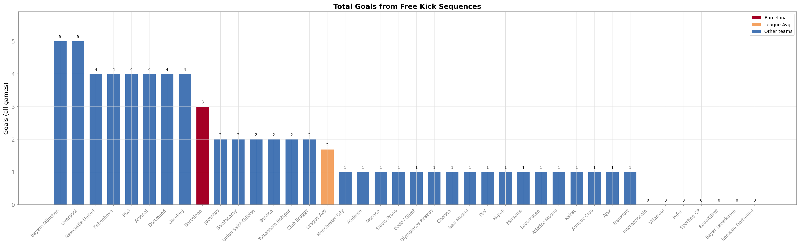 
<figcaption style="margin: 0 0 35px 5px">Total goals from Free-kicks - Barcelona above average</figcaption>

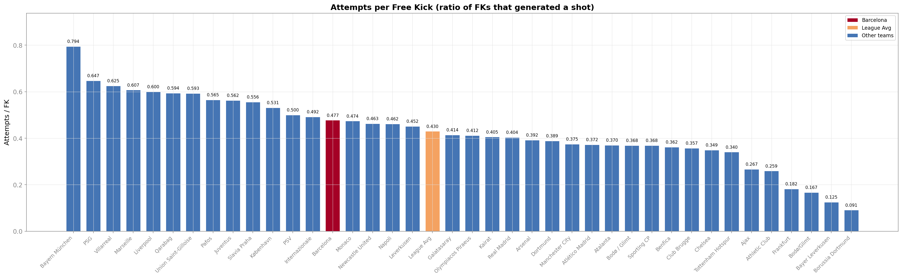 
<figcaption style="margin: 0 0 35px 5px">Attempts per Free-kick - Barcelona above average</figcaption>

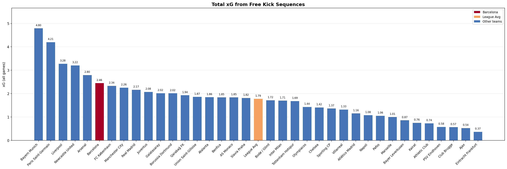 
<figcaption style="margin: 0 0 35px 5px">Total xG from Free-kicks - Barcelona above average</figcaption>

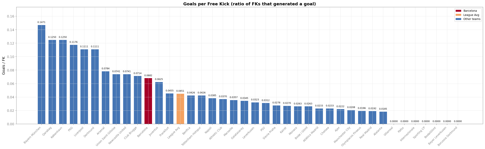 
<figcaption style="margin: 0 0 35px 5px">Goals per Free-kick - Barcelona significantly above average</figcaption>

#### Offensive Corner Sequences

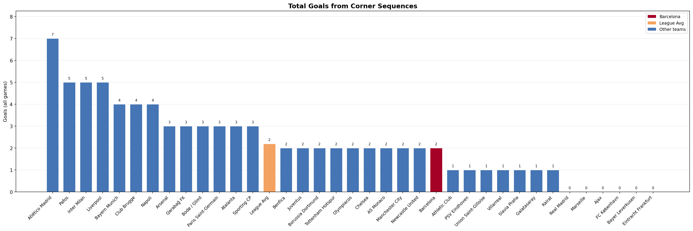 
<figcaption style="margin: 0 0 35px 5px">Total goals from Corners - Barcelona matches average</figcaption>

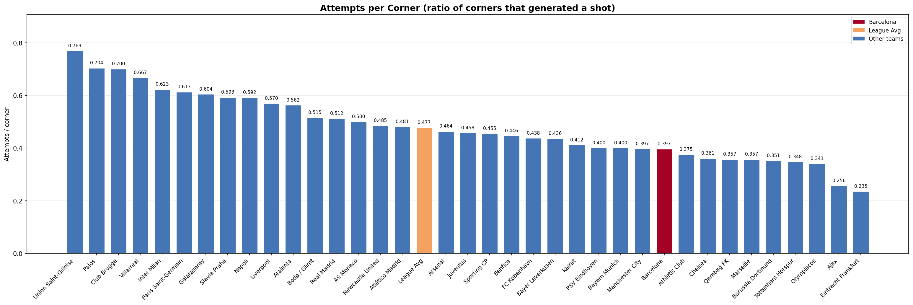 
<figcaption style="margin: 0 0 35px 5px">Number of Attempts per Corner - Barcelona below average</figcaption>

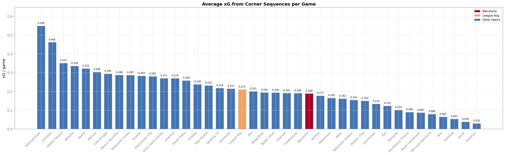 
<figcaption style="margin: 0 0 35px 5px">Average xG generated after Corners - Barcelona below average</figcaption>

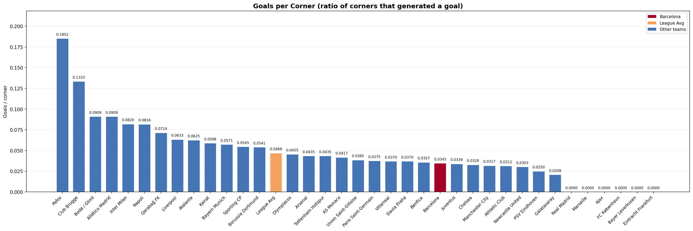 
<figcaption style="margin: 0 0 35px 5px">Goals per Corner - Barcelona below average</figcaption>

### Defensive Set-Pieces

#### Defensive Free-kick Sequences

Please note that usually free-kicks are analysed that happened in the attacking/defending third of the pitch.

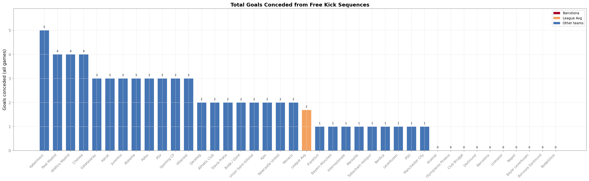 
<figcaption style="margin: 0 0 35px 5px">Total goals conceded from Free-kicks - Barcelona below average</figcaption>

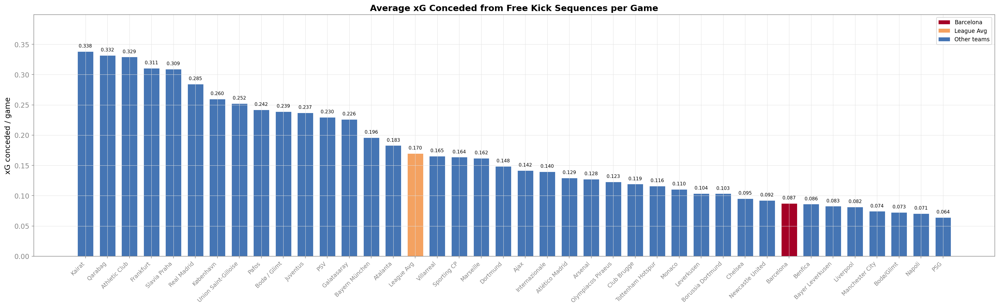 
<figcaption style="margin: 0 0 35px 5px">Average conceded xG from Free-kicks per Game - Barcelona below average</figcaption>

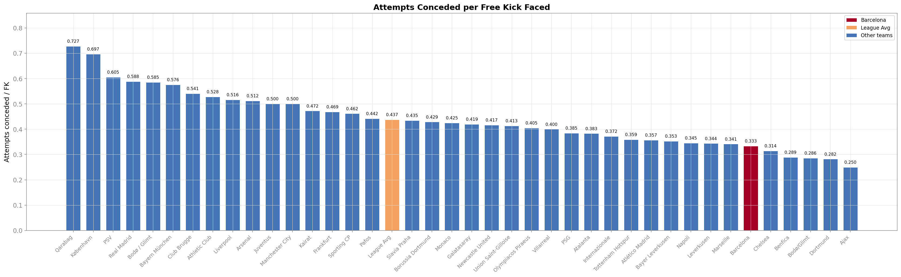 
<figcaption style="margin: 0 0 35px 5px">Average conceded Attempts from Free-kick Sequences - Barcelona below average</figcaption>

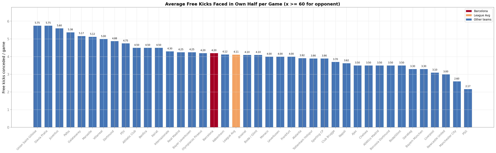 
<figcaption style="margin: 0 0 35px 5px">Number of Free-kicks conceded - Barcelona above average</figcaption>

#### Defensive Corner Sequences

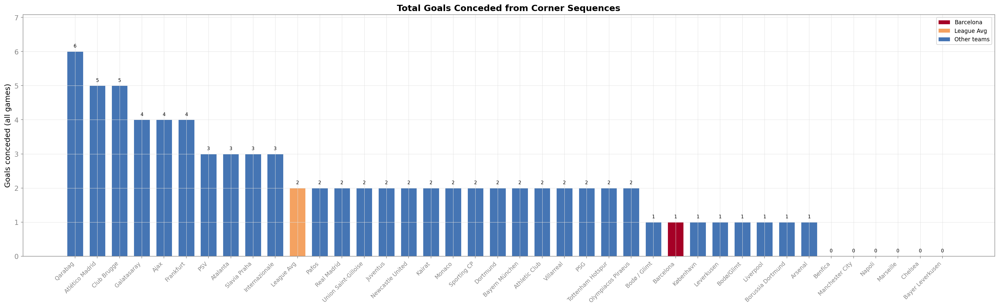 
<figcaption style="margin: 0 0 35px 5px">Total goals conceded from Corners - Barcelona below average</figcaption>

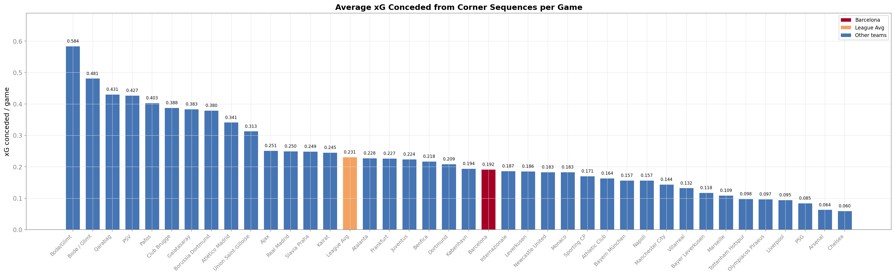 
<figcaption style="margin: 0 0 35px 5px">Average conceded xG from Corners per Game - Barcelona below average</figcaption>

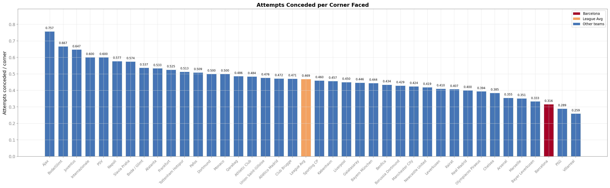 
<figcaption style="margin: 0 0 35px 5px">Average conceded Attempts after Corners - Barcelona significantly below average</figcaption>

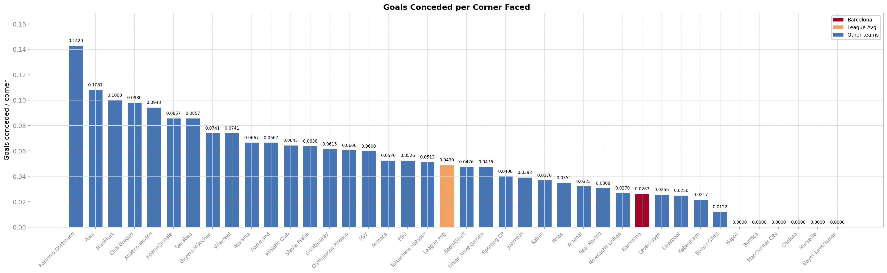 
<figcaption style="margin: 0 0 35px 5px">Goals conceded per Corner - Barcelona performs well</figcaption>

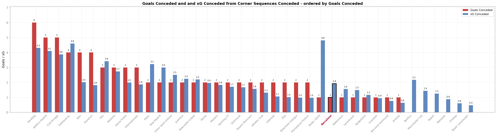 
<figcaption style="margin: 0 0 35px 5px">Goals conceded after Corners vs. xG conceded after Corners</figcaption>

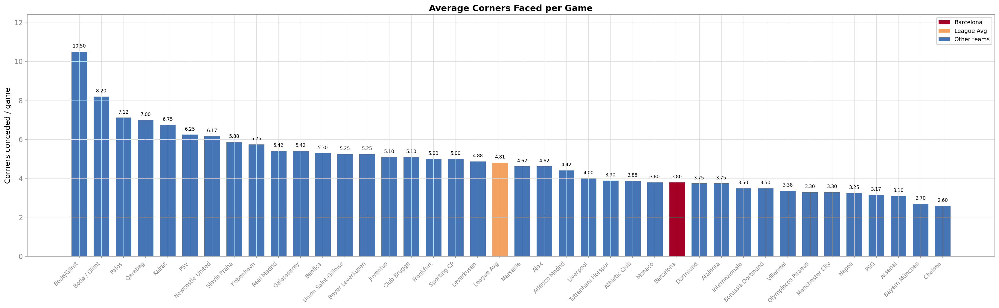 
<figcaption style="margin: 0 0 35px 5px">Average Corners faced per Game - Barcelona below average</figcaption>