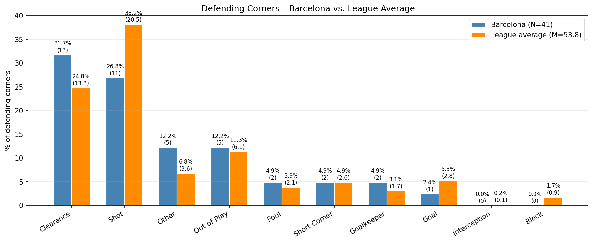
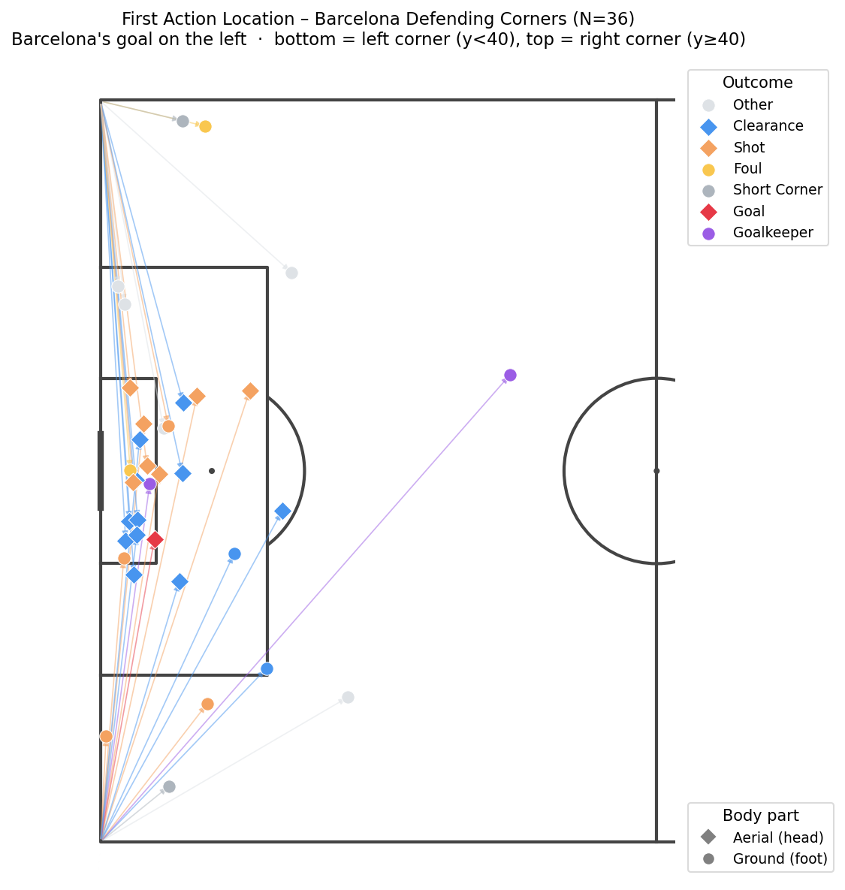
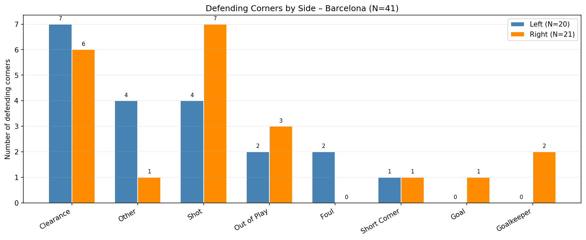
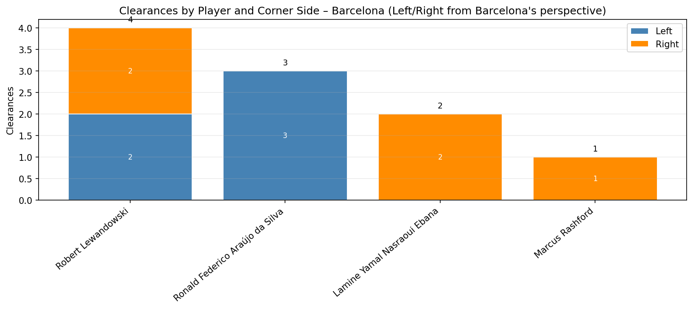

## Defensive Analysis: Defending Corners

This section examines FC Barcelona’s defensive performance against opponent corners in the current Champions League season. The analysis begins with a broad evaluation of defensive success metrics against league averages, explores the structural and spatial setup of the team, and finally interprets individual contributions and side-specific vulnerabilities based on the provided visual data.

### Overall Defensive Efficiency

The first key finding is that despite possessing a squad with a generally smaller physical profile compared to many elite European teams, Barcelona defends corners significantly better than the Champions League average. 

The `defending_corners.png` chart clearly illustrates this superiority. According to the visualization, Barcelona suppresses opponent shot creation highly effectively, conceding a shot on only 26.8% of defensive corners—markedly lower than the league average of 38.2%. Furthermore, the graphic shows their goal concession rate from corners is just 2.4%, less than half of the league average of 5.3%. 

Conversely, the same chart reveals Barcelona actively clears the ball on 31.7% of corner deliveries, outperforming the league average of 24.8%. This suggests that what Barcelona might lack in raw height, they make up for in structural organization and positioning.

### Defensive Structure and Setup

Barcelona employs a hybrid marking system that avoids hyper-aggressive, tight man-to-man marking, relying instead on a calculated blend of zonal control and situational man-marking.

* **Zonal Core:** 2–3 players are tasked with purely zonal duties, heavily concentrated around the near post and the central 6-yard area. 
* **Targeted Man-Marking:** Key aerial threats from the opposition are assigned specific man-markers. Tracking data distances note a structural shift here: Barcelona decreases the average marking distance to key attackers when facing distinctly tall teams (e.g., PSG, Newcastle) compared to shorter teams, adjusting their tightness based on the opponent's physical profile.
* **Perimeter Control:** 1–2 players are stationed outside the penalty box to contest second balls or engage short-corner routines.

### Spatial Analysis and The "Danger Zone"

While Barcelona is generally successful at clearing their lines, analyzing the locations of first actions reveals specific spatial vulnerabilities. 

The `def_corner_first_action_scatter.png` plot is particularly revealing here. It shows that when opponents do manage to create danger, it is highly localized. Almost all successful opponent shots (marked as orange diamonds) and goals (red dots) originate directly along the line of the 6-yard box, particularly in the central and slightly near-post areas. 

This is corroborated by the `def_corners_aerial_delivery.png` scatter plot, which confirms that aerial duels lost near this specific "goalkeeper line" represent the highest risk. Deliveries that bypass the initial near-post zonal blockers and drop into this micro-zone very frequently result in a direct attempt on goal. 

Furthermore, the `def_corner_first_action_dist.png` histogram illustrates the dense concentration of these initial contacts occurring within the critical 0-15 meter range from the goal.

### Left vs. Right Asymmetry

A notable trend in the data is a clear discrepancy in defensive stability depending on the side the corner is taken from (left vs. right from the perspective of Barcelona's goalkeeper).

The `defending_corners_by_side.png` chart shows Barcelona is notably more robust when defending corners from their left side. They concede nearly double the number of shots from right-sided corners (7 shots) compared to left-sided corners (4 shots), while left-sided corners result in slightly more direct clearances.

Adding context to this is the `def_corner_first_action_dist_by_side.png` distribution plot. It shows that the distance to the first action is wider and further out for right-sided corners (mean distance of 68.0m vs 56.6m on the left). While the right side sees some actions pushed further away, the volume of initial actions inside the box remains threatening and, as the shot data proves, more frequently successful for the opponent.

### Individual Contributions

While the system relies on collective structure, the clearance data highlights that specific individuals shoulder the majority of the aerial burden. 

Surprisingly, **Robert Lewandowski** is a vital pillar of Barcelona's corner defense. As the chart illustrates, he leads the team with 5 total clearances (split relatively evenly across left and right sides) and ranks second in overall defensive aerial events. 

**Ronald Araújo** is the other dominant force, registering 4 clearances and leading the team with 4 total aerial events. Interestingly, the data breakdown indicates all 4 of Araújo's recorded clearances came from left-sided corners. This heavy reliance on Araújo to sweep the left side heavily contextualizes the findings in the side-by-side plots, explaining why the left side is statistically safer while the right side leaks more shots. Pau Cubarsí and Gerard Martín also provide functional support, as visualized in the lower tiers of the clearance chart.
