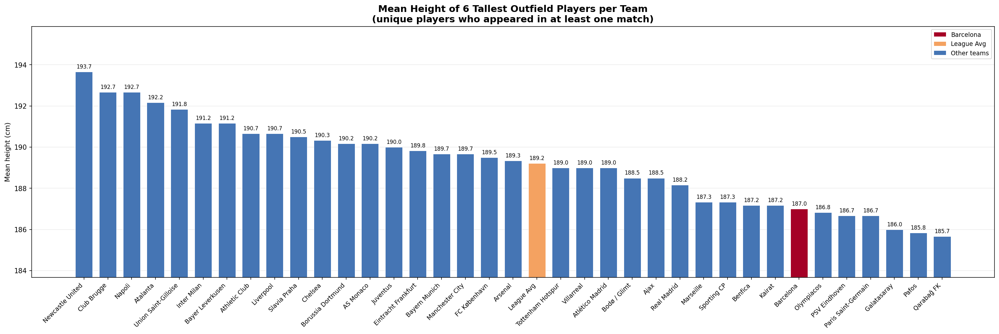

Project Group

| handle | name |
|--------|------|
| @leoschmidt     | Leo Schmidt-Traub |
| @kdanchishin     | Kirill Danchishin |
| @pvonder     | Philipp von der Thannen |
| @nwessbecher    | Niklas Weßbecher |
| @mwoeltje     | Merlin Wöltje |

- [x] check this if your final results may be shared with clubs, associations, or companies

TA Comments(Last edited: 16.03.2026)

Your teaching assistant is Luca Schnyder ( @schnyderl ) and can be reached at <schnyderl@student.ethz.ch>

- [ ] when saving, please indicate what you have changed in a meaningful commit message
- [x] first assignment due: **March 12**
- [ ] second assignment due: **April 12**
- [ ] report and poster due: **May 24**

**(16.03.2026)**

Congratulations, you have successfully completed your first assignment! It's great that you went beyond the minimum, keep it up!
The first assignment was designed to familiarize you with GitLab, encourage you to make use of the data and document the steps you took to reach your result, and perhaps visit other groups’ pages. As this was a rather elementary analysis, note that the results of this first assignment can but do not have to stay on your page.
Looking forward to the second assignment: The core intention will be to practice the documentation and interpretation analysis. This serves as an opportunity to meet the requirements of documenting analyses for replication and interpreting your results meaningfully. Please approach this round of analysis with high quality, such that you may find it suitable to include directly in your final report later. Interpretation means providing contextualized meaning rather than simply pointing out which numbers are larger/smaller than others. It involves explaining results and translating those findings into meaningful conclusions. (That's also where GenAI often fails).
If you gather general informations or conduct analyses about the team that aren't directly related to your assignment, add them to the team page and collaborate with the other groups to create this page. This is highly encouraged and will also be considered.

Additionally, I’d also like to point out the following:

1) If you choose to create subpages, please make it easier for us to find them by always 1) link them in your group's main page and 2) ensuring that they appear as subpages of your main page in the wiki structure. This can be done by specifying the path of your subpage. Eg, if you are team AJX AD (with page path AJX-AD) and want to create a passing subpage, your subpage should have the path AJX-AD/passing.
2) All code snippets should be entered into the snippet repository [here](https://gitlab.ethz.ch/socceranalytics/uefa-cl-2025-2026/-/snippets). Please ensure you follow all the guidelines [here]( https://gitlab.ethz.ch/socceranalytics/uefa-cl-2025-2026/-/wikis/snippet-overview) when detailing your code. Refer to the provided $2642 or $2643 snippets for examples of what is expected. If your snippet is something new and helpful for other teams, feel free to add it to the [snippet overview page](/snippet-overview) so that other teams can find it more easily.
3) When writing your analysis, always reference the code snippets you used by including $[snippet_id] in your text—this applies whether your team created the snippet or it came from another team. Additionally, when you create a new snippet, make sure to link back to your analysis page so that other teams can see the snippet in context and understand what it does.
4) Please enter meaningful commit messages instead of using the default “Update [page name]“. As your report will grow the lack of appropriate commit messages makes it very hard for your TA to keep track of what has changed on your page.

5) As a reminder, please be extremely careful when using AI tools with the dataset. The data has been shared with us under the strict condition that it must not be leaked or distributed outside the ETH Zurich environment. You may keep a local copy on your machine for analysis, but the dataset must not be uploaded to external platforms or third-party cloud services (e.g., Google Colab, Google Drive). If you would still like to use AI tools, ETH provides access to certain options within a protected environment. Please refer to: <https://ethz.ch/en/the-eth-zurich/education/ai-in-education/tools.html>. In particular, ETH offers Microsoft Copilot in this protected setup (note that this is not the same as GitHub Copilot).

If you have any more questions, don’t hesitate to contact me or stop by at the open lab hours (Q&A session) on Wednesday from 12-14h at LEE D101.

## Introduction

## Stats

The purpose of this section is to provide an overview of FC Barcelona’s performance in the current UEFA Champions League season, identify broader tendencies in their use of set pieces within their tactical approach, and compare these patterns with those of their competitors.
It should be noted, however, that the sample size is small, and the conclusions we draw only apply to this tournament and do not support broader general conclusions.
We generate statistics for offensive and defensive set-pieces with the snippet $2765, using data from the league phase and round of 16.

### Offensive Set-Pieces

#### Free-kick Sequences

Barcelona’s attacking free-kick profile is one of the clearest positive signals in the dataset.

They scored **3 goals from free-kick sequences**, clearly **above the competition average of 1.7** and placing them in the upper group of teams.
Their process numbers also support this.
They **generate a shot from 47.7% of attacking free kicks**, compared with a **league average of 42.1%**.
Their total **xG from free-kick sequences is 1.8**, higher than the **league average of 1.5** (league phase only).
Most strikingly, their **goal conversion per free kick is 6.8%**, well above the **competition average of 4.3%**.

This combination is important.
Barcelona are not only converting unusually well as they also produce above-average shot volume and xG from these situations.
That means this is not just a finishing spike, but a reasonably well-supported offensive strength.
The overview therefore suggests that Barcelona's attacking free-kick routines are above average effective both in chance creation and final outcome.

#### Corner Sequences

The picture changes considerably for attacking corners -- Barcelona scored 2 goals from corner sequences, exactly matching the competition average.

Their **attempt rate per corner is 44.7%**, below the league average of 48.8%.
Their average xG from corners per game is 0.189, below the average of 0.219, and their **total corner xG is 1.9** compared with a **competition average of 2.1**.
Their **goal rate per corner is 4.3%**, again **below the competition mean of 5.1%**.

So while Barcelona are not weak from corners, they are also not one of the standout attacking corner sides in this UCL field.
In overview terms, that is one of the most important findings from the plots.
It suggests that Barcelona’s current set-piece profile should not be framed too heavily around corner dominance only in the subsequent report.
It is to note that this does not contradict the tactical literature entirely (especially due to the limited number of observations), but emphasises the need to analyse structure, manipulation, and match-specific execution, which only becomes visible in the later sequence-based analysis.

#### Offensive Interpretation and Implications for further Analysis

Barcelona’s attacking set-piece profile suggests an effective but not uniformly dominant side across all dead-ball situations.
The clearest offensive strength appears in free-kick sequences rather than corners. Barcelona perform clearly above average in attacking free-kick situations, both in terms of goals and underlying chance creation, while their attacking corner output is closer to average, or slightly below average, across attempts, expected goals, and conversion.
This may indicate that under Hansi Flick, Barcelona have become more effective in structured, direct attacks following restarts, without necessarily showing clear superiority in aerial situations or corner output.
Taken together, this points to a set-piece profile that is more efficient in free kicks than dominant in corners, which slightly qualifies the literature-based expectation of Barcelona as a particularly corner-focused attacking side under Flick.

This is particularly relevant for the subsequent analysis, as it helps define the main analytical focus.
In the case of free kicks, the key question is why these routines generate efficient outcomes.
For corners, the more relevant question is whether the underlying tactical structure is stronger than the raw output alone suggests.

### Defensive Set-Pieces

#### Free-kick Sequences

FC Barcelona **0 goals from free-kick sequences**, while the competition average is 1.7.
This is also reflected in their average xG conceded from free-kick sequences per game which is only 0.087, far below the mean of 0.169.
They allow shots from just 33.3% of free kicks faced in their own half of the pitch, compared with a league average of 43.6%.

This is **especially notable because Barcelona concede 4.2 free kicks in their own half per game**, which is slightly **above the competition average of 4.06**.
In other words, they are not simply avoiding these situations entirely, they appear to be managing them very effectively once they occur.
That makes defending free kicks one of the clearest strengths of Barça in the quantitative overview.

#### Corner Sequences

Barcelona also defend corners similarly well in the UCL sample.
They **concede only 1 goal from corner sequences**, compared with a **competition average of 2.1**.
Their average xG conceded from corners per game is 0.189, lower than the league average of 0.234.
They **allow a shot from only 31.4% of corners faced**, dramatically **lower than the average of 47.2%**, and they concede goals on just 2.6% of corners faced, compared with a competition mean of 5.0%.
Barça also faces relatively few corners in the first place: 3.8 corners conceded per game versus a competition average of 4.84.

It is particularly interesting given the tactical literature that often frames Barcelona as potentially vulnerable to physical or aerial stress.
In this UCL sample, the aggregate numbers do not show an obviously fragile corner-defending side.
Instead, they show a team that is, at minimum, well above average in suppressing corner danger.

#### Defensive Interpretation

The defensive overview is arguably the most striking part of the dataset.
Barcelona looks consistently solid to strong across both major set-piece types, especially in the prevention of attempts and xG.
This matters for the interpretation of Barcelona’s style.
A team with an aggressive, front-foot, high-line identity is often assumed to be more exposed in restart situations, especially against physically strong opponents.
Based on our UCL data, Barcelona instead look like a side whose overall set-piece defending is organised, controlled and efficient.
That may suggest improvements in collective spacing, first-contact control, or opposition shot suppression, even if some individual sequences later might reveal vulnerabilities.
Such improvements of defensive weakness should later be tested through sequence-level evidence rather than assumed from reputation.

### Set-Piece Performance in FC Barcelona Matches

Across Barcelona’s individual UEFA Champions League matches, the set-piece data indicate a team whose dead-ball output was highly dependent on match context rather than consistently strong across games.
This aligns with the broader overview that Barcelona was not a clear corner outlier overall, but still able to generate substantial value from set pieces in specific match situations.

Their corner volume and corner xG vary considerably.
For example, against Copenhagen, Barcelona created strong attacking pressure from corners (10 corners, 8 corner-sequence attempts and 0.71 xG), yet failed to score.
In contrast, matches against Club Brugge and Chelsea produced almost no attacking corner output.
This suggests that Barcelona’s corner threat depends strongly on game state, territorial dominance, and especially opponent behaviour, rather than on a stable level of corner efficiency.

Free-kick sequences, by comparison, appear to provide more consistent value.
Particularly productive performances were observed against Frankfurt (0.38 xG, 0 goals), Copenhagen (0.58 xG, 2 goals), and one match against Newcastle (0.40 xG, 1 goal).
This supports the earlier interpretation that Barcelona’s stronger attacking set-piece profile in this campaign was driven more by free kicks than by corners.

### Player Physicality

The physicality plots show that Barcelona are among the less physically dominant teams in the competition in terms of height.
The mean height of their six tallest outfield players is 187.0 cm, clearly below the competition average of 190.1 cm, and this lower profile is also evident in several individual matches, particularly against taller opponents such as Newcastle (193.3 cm) and Slavia Praha (190.2 cm).

We generate the plot using snippet $2769

This is relevant in light of the set-piece findings so far.
Barcelona’s relatively modest corner output and their greater attacking effectiveness in free-kick sequences than in corners, are consistent with a team that does not rely on clear aerial superiority.
Instead, their set-piece profile appears to depend more on delivery quality, movement, structure and spatial manipulation.
At the same time, their strong defensive set-piece numbers despite this physical disadvantage suggest that their success is driven less by size than by organisation, shot suppression and collective control of set-piece situations.

## Offensive Set-Pieces

[Offensive Corners](BAR-SP/offensive_corners)

## Defensive Set-Pieces

[Defensive Corners](BAR-SP/defensive_corners)
