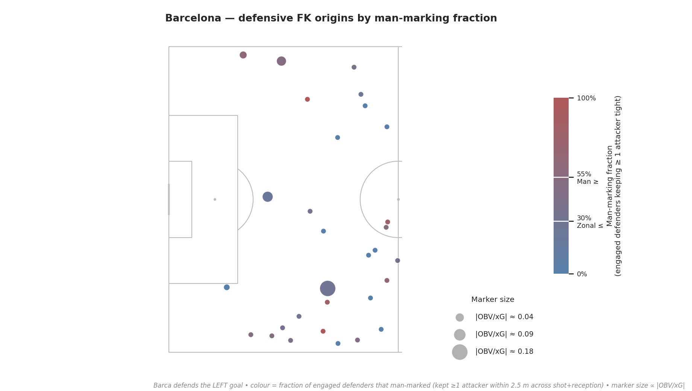

# Defensive Analysis

## Defensive Corners

## Defensive Free-kicks

As already mentioned in the [statistics section](BAR-SP/statistics#defensive-free-kick-sequences), Barcelona conceded 1 goal from free-kicks, which is less than the competition average of 1.94.
This finding is also reflected in their average xG conceded from free-kick sequences per game which is only 0.091, far below the mean of 0.183 [(stat-df2)](BAR-SP/statistics_plot#average-conceded-xg-from-free-kicks-per-game---barcelona-below-average).

In light of this information, defensive free-kicks are one of Barcelona’s clearest strengths.

### Added Value of Defensive Free-kicks

So the overview seems positive, but let us take a more granular look at the added value of defensive free-kicks.
In the plot below, we show, from left to right, heatmaps of xG, opponent OBV gain, and fouls for all free-kicks in Barcelona’s defensive half.

TO BE IMPROVED/MADE INTO A CONTINUOUS TEXT
These pictures paint an interesting picture:

1. The xG/OBV doesn't tell the whole story: if the opponent was previously in a more dangerous position, a free-kick can represent a net gain for the defending team. A better way of analyzing this is to look at the change in opponent's OBV from the play leading up to the free-kick to the moment following the free-kick.
2. This perspective helps us see how free-kicks are used in Barcelona's defensive strategy: they allow the team to mitigate dangerous situations.
3. The new picture flips the left-right asymmetry: though free-kicks on the left side of the field are more dangerous, their net effect on the OBV is more positive than right-side free-kicks.
4. This tradeoff is further emphasized by the foul heatmap: more fouls are committed on the right side, and are committed further away from the goal. Thus, a more aggressive defensive strategy leads to more premature fouls, which decreaseys the absolute danger, but represents a more worse OBV trade.  
5. The card record confirms the asymmetry: Barcelona's right-side centre-backs (Cubarsí, Araújo, Eric García) absorb all 3 red cards plus 3 yellows, while the left-side group (Cancelo, Balde, Gerard Martín) takes 5 yellows and zero reds.

6. TODO: tie this back to Flick's overarching strategy — is the right-side aggression a deliberate trigger (force errors on Yamal/Koundé's flank) or a personnel artefact of Araújo/Cubarsí's duelling profile?

The code for the foul/xG/OBV plot can be found in snippet UNKNOWN. The first plot was inspired by the RMA-SP group's snippet $3111. The cards-by-side plot is produced by snippet UNKNOWN.

### Zonal vs man-marking defense

As mentioned in the [analysis of previous reports](BAR-SP/previous-analyses#review-finders-on-defensive-set-pieces), Barcelona's defensive set-piece strategy uses a mix of man-marking and zonal defense.
For corner kicks, where the shooting position is always the same, players are usually given fixed roles, for example Lewandowski and Raphinha are the two zonal defenders in the near-post corridor, whilst Pedri is a man-marker in the middle of the box. Free kicks offer more variation in the shooting position, and we look at whether that translates into a more varied defensive strategy.

#### Method

StatsBomb does not tag the marking system directly, so we infer it from SkillCorner tracking. For every opponent free-kick delivery in Barcelona's defensive half (35 events across all matches from league phase to quarterfinals — both `free_kick_reception` and Barca-side `free_kick_interception`), we take **two** freeze-frames: the reception itself, and a *shot frame* 2 s earlier that approximates the moment the FK is struck. For each Barcelona outfielder we compute the set of attackers within **2.5 m** at each frame; that defender is

- *engaged* if either set is non-empty (ignoring forwards parked upfield with no contact),
- *man-marking* if the two sets share at least one attacker — i.e. they kept the same opponent tight across the delivery — and
- *zonal* if engaged but the sets are disjoint (the attacker they were close to has moved past, replaced by a different one or none at all).

An FK is then **Man-Marking** if ≥ 55% of engaged defenders man-marked, **Zonal-Marking** if ≤ 30%, and **Hybrid** otherwise. The same check, aggregated per player across all FKs where they were engaged, gives each player a *man-marking rate* and a role label (Man-Marker ≥ 55%, Zonal ≤ 20%, Mixed in between).

1. **No single scheme dominates.** Of the 35 FKs, 43% are classified Zonal, 31% Hybrid and 26% Man-Marking — the three categories are within a factor of two of each other, which means Barcelona is not a "zonal team" or a "man-marking team" on free kicks but mixes both modes situationally.
2. **There is a clear man-marker tier among the regulars.** With ≥ 4 engaged FKs, Gerard Martín (62%, 10/16), Marc Bernal (60%, 3/5), Ronald Araújo (60%, 3/5) and Pau Cubarsí (55%, 6/11) sit at or above the Man-Marker threshold; Ferrán Torres tops the chart at 75% (3/4) on a small sample. These are the centre-back and full-back profiles you would expect to track aerial threats one-on-one.
3. **The midfield is genuinely mixed.** Eric García, Koundé, Lewandowski, de Jong, Dani Olmo and Yamal all sit in the 28–40% band — engaged often, but their assigned attacker tends to drift, consistent with a hybrid block that picks up runners rather than locking onto a single target.
4. **Pedri is the most zonal regular.** He is classified Zonal (18%, 2/11): on free kicks Pedri repeatedly *holds space* rather than tracking a runner — the opposite of his role on corners. Cancelo (20%) and Rashford (0%) round out the Zonal tail.
5. **Strategy varies match-to-match and ramps up against stronger opposition.** Mean man-marking fraction per match spans 8% (PSG) to 61% (Newcastle last-16 second leg). Knockout opponents (Chelsea 27%, Atlético-leg-1 43%, Slavia 50%, Newcastle KO 61%) sit well above the league-phase minnows (PSG 8%, Atlético-leg-2 14%, Olympiakos 25%) — Barca clearly leans on man-marking when the aerial threat warrants it.
6. **TODO:** analyze pitch plot or remove, show a few individual plays for illustrative purposes.

The code for these plots can found in snippet UNKNOWN.

### Free-kick trajectories

Inspired by the LEV-SP group's approach to plotting free-kick runs are arrow trajectories, we do the same for Barcelona's free-kicks, specifically those that led to a shot.

Findings:

1. The amount of shot-creating free-kicks increases exponentially as we get closer to the goal.
2. Furthermore, only 5/11 trajectories have more than 2 arrows => the real danger comes from direct free-kicks or cross + shot actions
3. **TODO:** Find a more substantive interpretation or remove this analysis

The code is a very slightly modified version of Leverkusen's snippet $3206.

### Additional Free-kick analyses

- Find some way to tie height narrative into free-kicks
- Some kind of convex hull/voronoi pitch control
- Look at how Barcelona can leverages defensive free-kicks to create counter-attacks
- Look at how free-kick tactics vary in different match phases/when Barcelona is in the lead

## Defensive Throw-ins

Barcelona is one of the best teams in the Champions League at winning the ball back from opponent throw-ins, reclaiming possession in 31.3% of cases — ranking 5th across the competition.

This success is not accidental. A look at Barcelona's positioning during opponent throw-ins reveals a clear, consistent system built on two complementary principles.

**Pressing the ball and blocking the central corridor.** Barcelona applies immediate pressure close to the throw-in taker while simultaneously occupying the middle corridor of the pitch. Together, these two actions leave the opponent with only one viable option: playing the ball along the sideline. The consequence is visible in the data — Barcelona concedes the fewest side changes of any team when defending opponent throw-ins.

The system is effective even when Barcelona does not win the ball back directly. In those cases, opponents still rarely manage to switch the side of play or penetrate through the central channel.

The win-back pattern is most pronounced in Barcelona's own defensive third. When the opponent plays into a central area in that zone, Barcelona tends to recover the ball.

**Individual roles: man-marking meets zonal coverage.** The individual winback situations reveal a clear structure. Barcelona man-marks tightly close to the throw-in while maintaining zonal coverage further back. One detail stands out: at least one player positions himself directly beside the throw-in taker without marking a specific opponent. His role is to close down the thrower immediately after the ball is played, preventing a quick return pass and disrupting any continuation of the move.

**Selective compactness.** Barcelona's proximity to opponents during throw-ins reflects this dual structure. While the average distance to the nearest opponent is broadly similar across teams, Barcelona stands out in its defensive and middle zones: the average of the five smallest distances per situation is 0.5 m below the league mean, while the five largest distances remain close to it. This is consistent with the system as a whole — tight man-marking on specific opponents, wider zonal coverage with the rest.

## Defensive Penalties

Barcelona conceded only one penalty across the entire Champions League campaign — making goalkeeper analysis largely redundant. The more interesting question is why: what about Barcelona's style keeps them out of penalty-conceding situations in the first place?

**Technical play reduces exposure.** The core explanation is that Barcelona's style avoids the situations that lead to penalties. A team that controls the ball cleanly in its own third rarely needs to commit the kind of desperate, contact-heavy challenges that referees punish. This shows up in pass completion: Barcelona ranks among the highest in the Champions League for pass completion in their own defensive third, and teams with higher completion rates tend to concede fewer penalties.

**Fewer fouls, fewer penalties.** The same logic applies to foul counts: a more aggressive playing style leads to more fouls overall, and more fouls create more opportunities for a penalty to be awarded. Barcelona commits fewer fouls per game than most of their Round of 16 peers, which is consistent with their possession-oriented, low-contact approach.

