# Defensive Analysis

## Defensive Corners
This section examines FC Barcelona’s defensive performance against opponent corners in the current Champions League season. The analysis begins with a broad evaluation of defensive success metrics against league averages, explores the structural and spatial setup of the team, and finally interprets individual contributions and side-specific vulnerabilities based on the provided visual data.

### Overall Defensive Efficiency

The first key finding is that despite possessing a squad with a generally smaller physical profile compared to many elite European teams, Barcelona defends corners significantly better than the Champions League average. 

The `defending_corners.png` chart clearly illustrates this superiority. According to the visualization, Barcelona suppresses opponent shot creation highly effectively, conceding a shot on only 26.8% of defensive corners—markedly lower than the league average of 38.2%. Furthermore, the graphic shows their goal concession rate from corners is just 2.4%, less than half of the league average of 5.3%. 

Conversely, the same chart reveals Barcelona actively clears the ball on 31.7% of corner deliveries, outperforming the league average of 24.8%. This suggests that what Barcelona might lack in raw height, they make up for in structural organization and positioning.

### Defensive Structure and Setup

Barcelona employs a hybrid marking system that avoids hyper-aggressive, tight man-to-man marking, relying instead on a calculated blend of zonal control and situational man-marking.

* **Zonal Core:** 2–3 players are tasked with purely zonal duties, heavily concentrated around the near post and the central 6-yard area. 
* **Targeted Man-Marking:** Key aerial threats from the opposition are assigned specific man-markers. Tracking data distances note a structural shift here: Barcelona decreases the average marking distance to key attackers when facing distinctly tall teams (e.g., PSG, Newcastle) compared to shorter teams, adjusting their tightness based on the opponent's physical profile.
* **Perimeter Control:** 1–2 players are stationed outside the penalty box to contest second balls or engage short-corner routines.

### Spatial Analysis and The "Danger Zone"

While Barcelona is generally successful at clearing their lines, analyzing the locations of first actions reveals specific spatial vulnerabilities. 

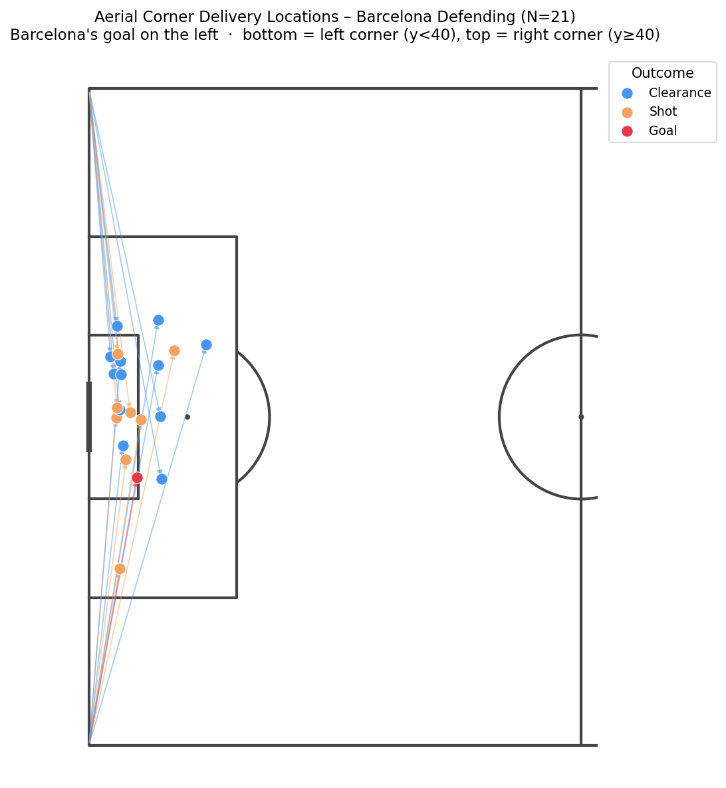

The `def_corner_first_action_scatter.png` plot is particularly revealing here. It shows that when opponents do manage to create danger, it is highly localized. Almost all successful opponent shots (marked as orange diamonds) and goals (red dots) originate directly along the line of the 6-yard box, particularly in the central and slightly near-post areas. 

This is corroborated by the `def_corners_aerial_delivery.png` scatter plot, which confirms that aerial duels lost near this specific "goalkeeper line" represent the highest risk. Deliveries that bypass the initial near-post zonal blockers and drop into this micro-zone very frequently result in a direct attempt on goal. 

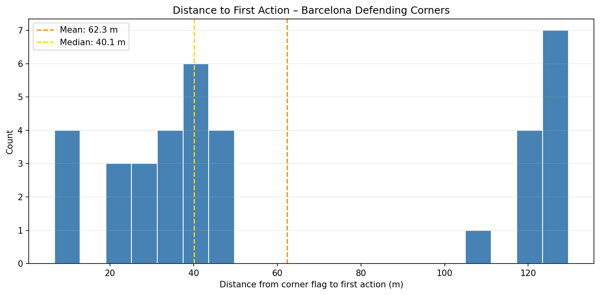

Furthermore, the `def_corner_first_action_dist.png` histogram illustrates the dense concentration of these initial contacts occurring within the critical 0-15 meter range from the goal.

### Left vs. Right Asymmetry

A notable trend in the data is a clear discrepancy in defensive stability depending on the side the corner is taken from (left vs. right from the perspective of Barcelona's goalkeeper).

The `defending_corners_by_side.png` chart shows Barcelona is notably more robust when defending corners from their left side. They concede nearly double the number of shots from right-sided corners (7 shots) compared to left-sided corners (4 shots), while left-sided corners result in slightly more direct clearances.

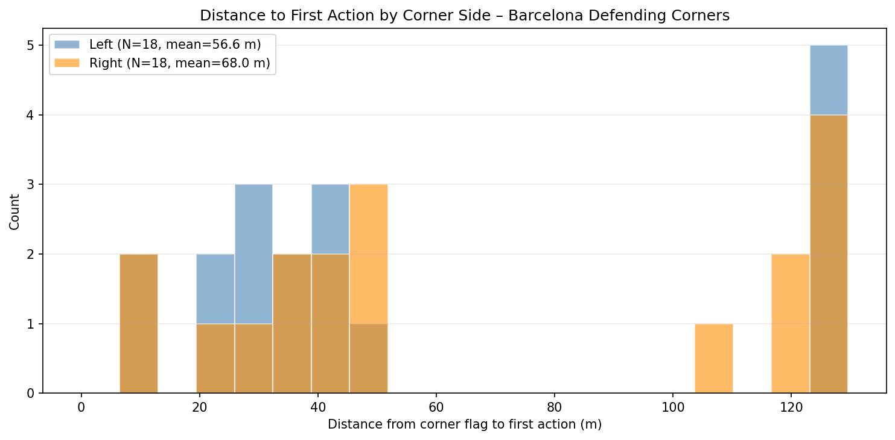

Adding context to this is the `def_corner_first_action_dist_by_side.png` distribution plot. It shows that the distance to the first action is wider and further out for right-sided corners (mean distance of 68.0m vs 56.6m on the left). While the right side sees some actions pushed further away, the volume of initial actions inside the box remains threatening and, as the shot data proves, more frequently successful for the opponent.

### Individual Contributions

While the system relies on collective structure, the clearance data highlights that specific individuals shoulder the majority of the aerial burden. 

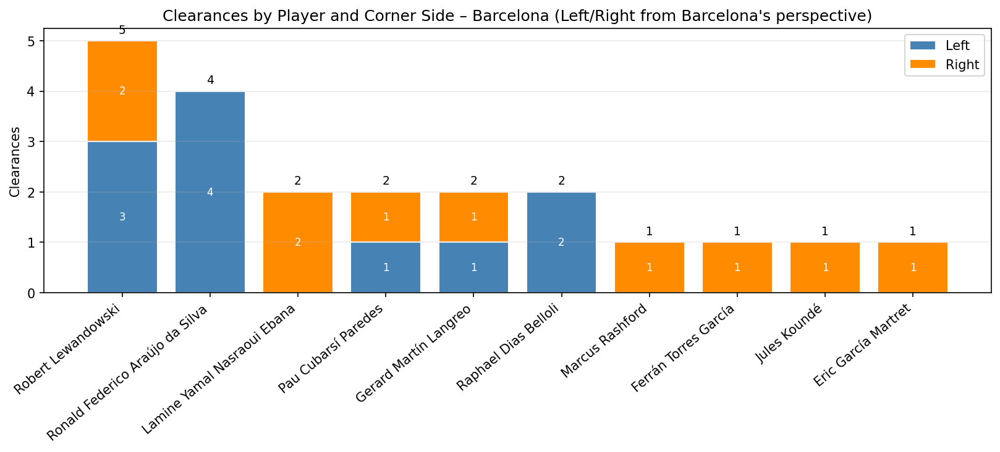

Surprisingly, **Robert Lewandowski** is a vital pillar of Barcelona's corner defense. As the chart illustrates, he leads the team with 5 total clearances (split relatively evenly across left and right sides) and ranks second in overall defensive aerial events. 

**Ronald Araújo** is the other dominant force, registering 4 clearances and leading the team with 4 total aerial events. Interestingly, the data breakdown indicates all 4 of Araújo's recorded clearances came from left-sided corners. This heavy reliance on Araújo to sweep the left side heavily contextualizes the findings in the side-by-side plots, explaining why the left side is statistically safer while the right side leaks more shots. Pau Cubarsí and Gerard Martín also provide functional support, as visualized in the lower tiers of the clearance chart.

## Defensive Free-kicks

As already mentioned in the [statistics section](BAR-SP/statistics#defensive-free-kick-sequences), Barcelona conceded 1 goal from free-kicks, which is less than the competition average of 1.94.
This finding is also reflected by their average xG conceded from free-kick sequences per game which is only 0.091, far below the mean of 0.183 [(stat-df2)](BAR-SP/statistics_plot#average-conceded-xg-from-free-kicks-per-game---barcelona-below-average).

In light of this information, defending free-kicks appear to be one of Barcelona’s clearest strengths.

### Added Value of Defensive Free-kicks

So the overview seems positive, but let us take a more granular look at the added value of defensive free-kicks.
In the plot below, we show, from left to right, heatmaps of xG, opponent OBV gain, and fouls for all free-kicks in Barcelona’s defensive half.
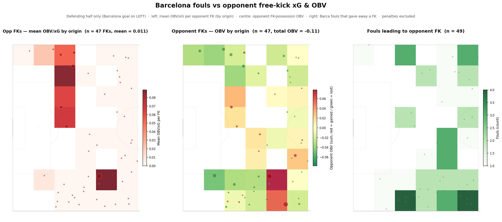
_Free-kick heatmaps for every opponent free-kick in Barcelona's defensive half. **1) Mean OBV/xG per free-kick**. For each opponent FK, the per-event value (StatsBomb `obv`, falling back to shot xG where `obv` is absent) is summed over the opponent's possession for up to 10 s after the restart, then averaged across all FKs in each cell **2) Net opponent OBV.** The same possession value summed (not averaged) per cell on a diverging scale: red cells are zones where free-kicks gain the opponent value, green cells are zones where the free-kick possession on average costs them value relative to open play. **3) Barcelona fouls that conceded a free-kick.** Dots mark individual free-kicks (panels 1–2, sized by magnitude) and individual fouls (panel 3). The code for the foul/xG/OBV plot can be found in snippet UNKNOWN. The first plot was inspired by the RMA-SP group's snippet $3111._

These pitch plots paint an interesting picture. First, despite it being a valuable indicator, the xG/OBV only tells one side of the story. 
For example, if the opponent was previously in a more dangerous position, a free-kick can represent a net gain for the defending team. 
A better way of analyzing this is to look at the change in opponent's OBV from the play leading up to the free-kick to the moment following the free-kick.
This perspective helps us see how free-kicks are used in Barcelona's defensive strategy: they allow the team to transform dangerous situations into (hopefully) more controlled, less risky sequences. 
The second plot flips the left-right asymmetry we see in the first: though free-kicks on the left side of the field are more dangerous (higher xG/OBV), their net effect on the OBV is more positive than right-side free-kicks.
This tradeoff is further emphasized by the foul heatmap: more fouls are committed on the right side, and are committed further away from the goal.
Thus, a more aggressive defensive strategy leads to more premature fouls, which decreases the absolute danger, but represents a more worse OBV trade.  
The card record confirms the defensive asymmetry: Barcelona's right-side centre-backs (Cubarsí, Araújo, Eric García) absorb all 3 red cards plus 3 yellows, while the left-side group (Cancelo, Balde, Gerard Martín) takes 5 yellows and zero reds.
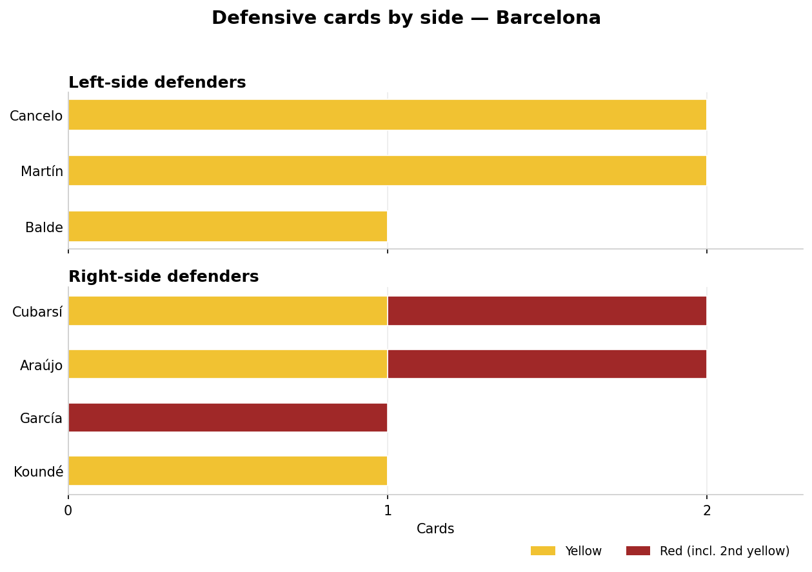
_Cards-by-side plot for Barcelona's defensive players. Code can be found in snipper UNKNOWN._

1. TODO: tie this back to Flick's overarching strategy — is the right-side aggression a deliberate trigger (force errors on Yamal/Koundé's flank) or a personnel artefact of Araújo/Cubarsí's duelling profile?

### Zonal vs man-marking defense

As mentioned in the [analysis of previous reports](BAR-SP/previous-analyses#review-finders-on-defensive-set-pieces), Barcelona's defensive set-piece strategy uses a mix of man-marking and zonal defense.
For corner kicks, where the shooting position is always the same, players are usually given fixed roles, for example Lewandowski and Raphinha are the two zonal defenders in the near-post corridor, whilst Pedri is a man-marker in the middle of the box. Free kicks offer more variation in the shooting position, and we look at whether that translates into a more varied defensive strategy.

#### Method

StatsBomb does not tag the marking system directly, so we infer it from SkillCorner tracking. For every opponent free-kick delivery in Barcelona's defensive half, we take **two** freeze-frames: the reception itself, and a *shot frame* 2 s earlier that approximates the moment the FK is struck. For each Barcelona outfielder we compute the set of attackers within **2.5 m** at each frame; that defender is

- *engaged* if either set is non-empty (this ignores forwards parked upfield with no contact),
- *man-marking* if the two sets share at least one attacker, approximating the player keeping a fixed target
- *zonal* if engaged but the sets are disjoint (the attacker they were close to has moved past, replaced by a different one or none at all).

An FK is then **Man-Marking** if ≥ 55% of engaged defenders man-marked, **Zonal-Marking** if ≤ 30%, and **Hybrid** otherwise. The same check, aggregated per player across all FKs where they were engaged, gives each player a *man-marking rate* and a role label (Man-Marker ≥ 55%, Zonal ≤ 20%, Mixed in between).

To illustrate the method, we animate the free-kicks that most clearly typify each system. Starting from all classified FKs, we keep only those with at least three engaged defenders, then take the two FKs with the lowest man-marking fraction as the zonal examples and the two with the highest as the man-marking examples. In each clip Barcelona is in red, the opponent in blue, and a black line joins every defender–attacker pair currently inside the 2.5 m tight radius. The `SHOT` and `RECEPTION` markers flag the two freeze-frames the classification actually compares.

**Zonal examples**
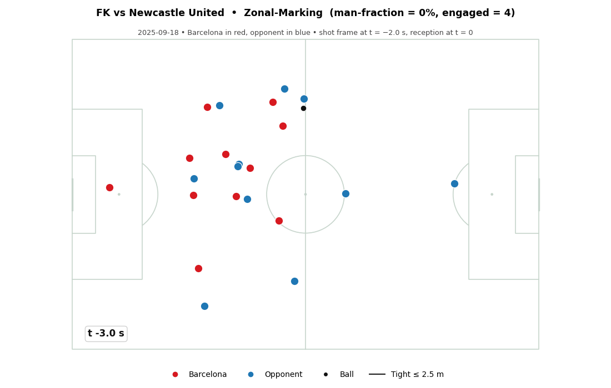 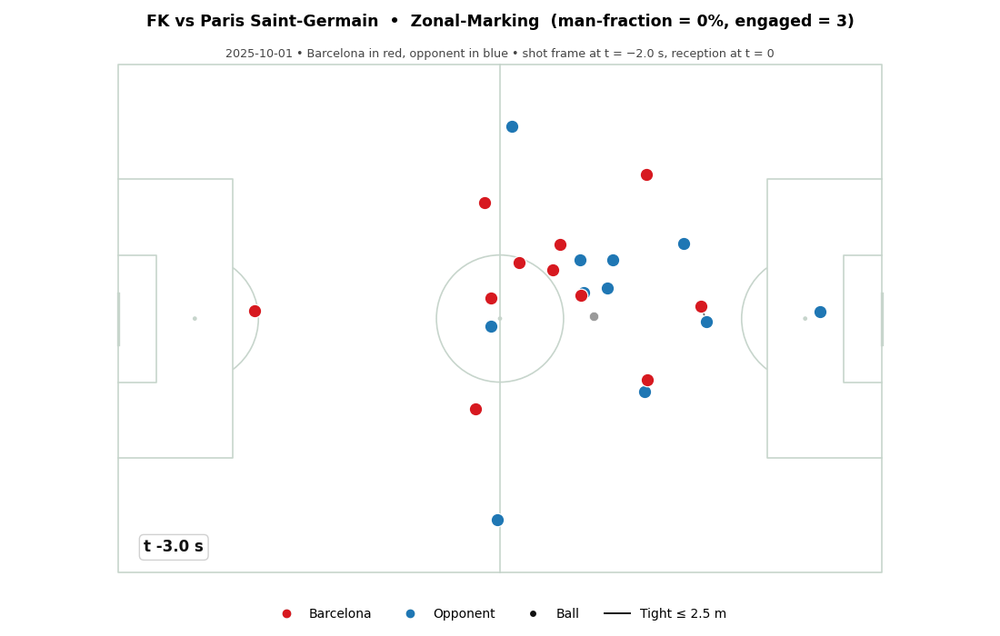
_Left: vs Newcastle United, 4 engaged defenders. Right: vs Paris Saint-Germain, 3 engaged defenders._

**Man-marking examples**
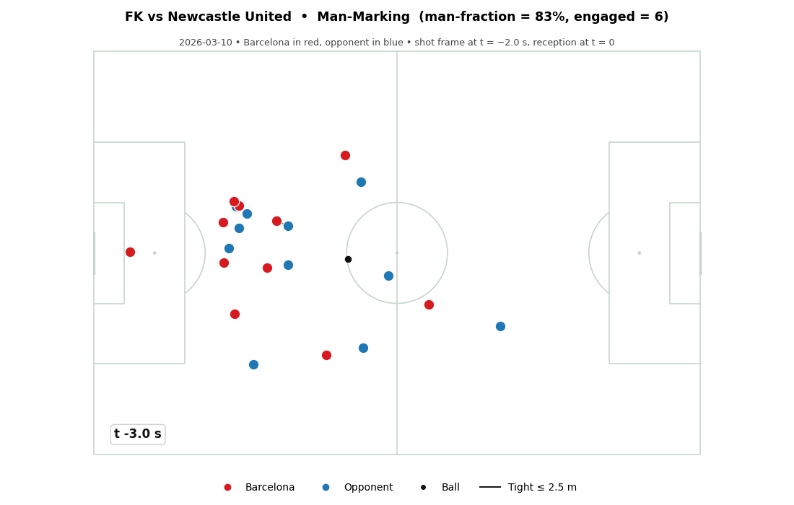 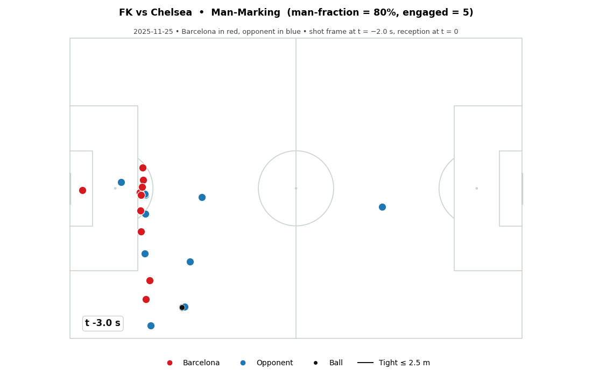
_Left: vs Newcastle United, 5/6 engaged defenders man-marking. Right: vs Chelsea, 4/5 engaged defenders man-marking._
Code for all GIFs (plotting and classification) can be found in snippet UNKNOWN.

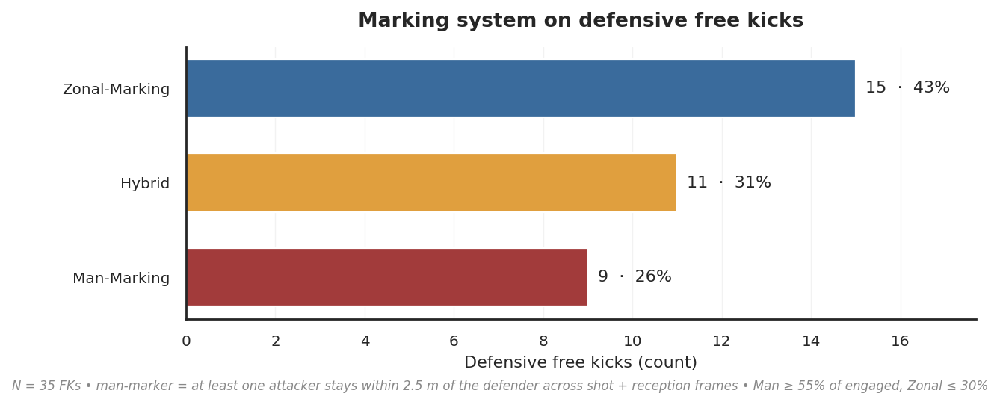
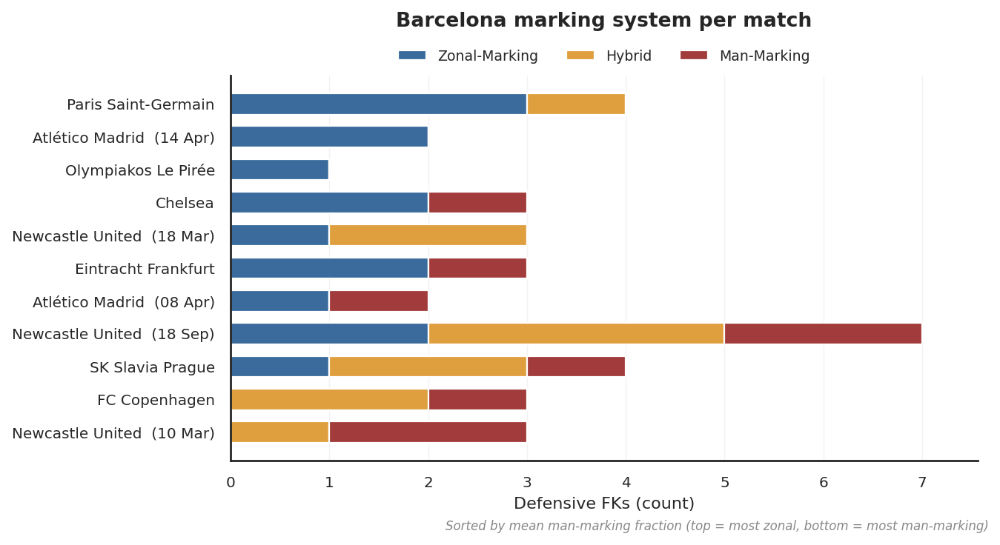
_Left: the team-level split of all 35 classified free-kicks across the three systems. Right: the same FKs broken down per opponent as stacked counts, with matches sorted top-to-bottom by mean man-marking fraction._

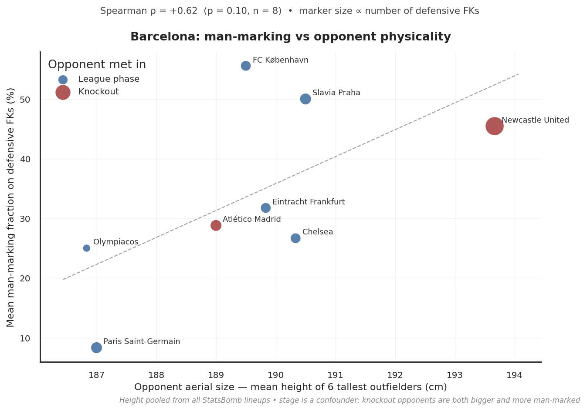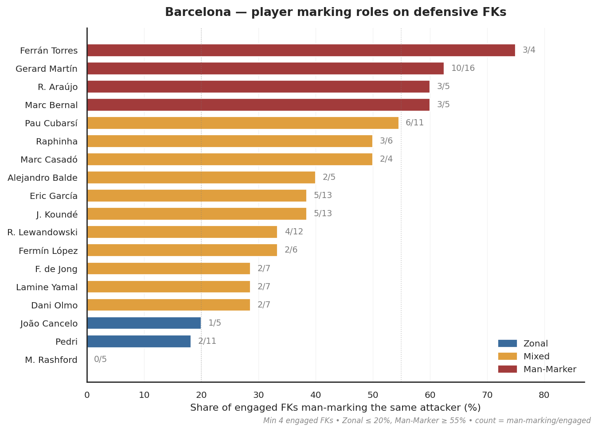
_Left: each opponent's aerial size against Barcelona's mean man-marking fraction on defensive FKs versus them; marker size scales with the number of FKs and colour with the stage the opponent was met in. Right: per-player man-marking rate: the share of the FKs a player was engaged in where they kept the same attacker tight across the delivery (minimum four engaged FKs)._

As shown by the first plot, the three categories are all well represent on aggregate, which means Barcelona's defensive free kick strategy cannot be neatly classified into one of two categories, but mixes both modes situationally.
The second plot shows that the strategy varies significantly based on the opponent: from PSG to Newcastle, Barcelona's strategy completely changes. 
A possible explanation for this is Barcelona's physicality: looking at the plot of mean top-6 size vs. mean man-marking fraction, we see a clear positive correlation between the two.
On face value, this might seem counter-intuitive: shouldn't man-marking be less effective against larger opponents?
To truly understand which tactics should be employed, we also need see how bigger opponents affect zonal defense. A counter-argument to the previous claim is that taller players create more pointed, localized threats, which are more effectively handled by man-marking, whilst zonal defense is better suited to deal with diffuse threats.
It is important to note that the probability of observing a correlation as least as strong as the one measured here, given the null hypothesis, is too high (p=0.10) to deliver any conclusions.
Finally players also fall into different categories:
- Gerard Martín (62%, 10/16), Marc Bernal (60%, 3/5), Araújo (60%, 3/5) and Cubarsí (55%, 6/11) sit at or above the Man-Marker threshold. Ferrán Torres tops the chart at 75% (3/4) on a small sample. These are the centre-back and full-back profiles you would expect to track aerial threats one-on-one.
- Eric García, Koundé, Lewandowski, de Jong, Dani Olmo and Yamal all sit in the 28–40% band — engaged often, but their assigned attacker tends to drift, consistent with a hybrid block that picks up runners rather than locking onto a single target.
- Pedri is the most zonal regular: on free kicks Pedri repeatedly *holds space* rather than tracking a runner. This is the opposite of his role on corners (c.f. [previous analyses](BAR-SP/previous-analyses.md)).
**TODO:** improve player analysis, tie in with previous analyses

### Free-kick trajectories

Inspired by the LEV-SP group's approach to plotting free-kick runs are arrow trajectories, we do the same for Barcelona's free-kicks, specifically those that led to a shot.
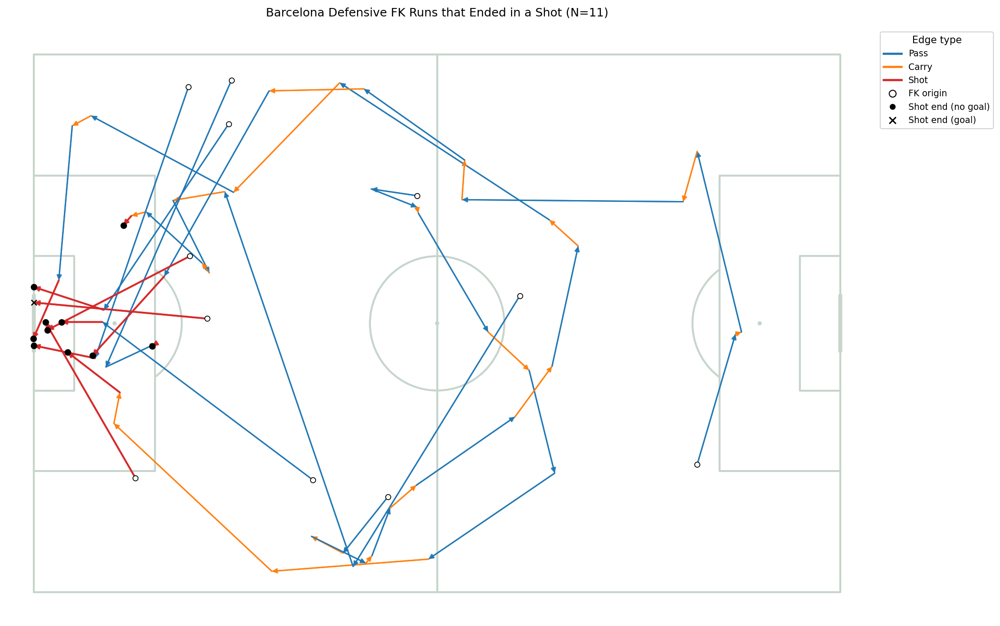
_Opponent FK runs that led to a shot. Blue arrows represent passes, yellow arrows carries and red arrows shots. The code is a very slightly modified version of Leverkusen's snippet $3206._

Observing these runs are trajectories of arrows allows us to see that the amount of shot-creating free-kicks increases exponentially as we get closer to the goal.
Furthermore, free-kicks that start further away require many more arrows to reach the goal (>10), to the point where the shot can no longer really be attributed to the free-kick itself.
Only 5/11 trajectories have more than 2 arrows, illustrating the two categories of free kicks leading to a shot: direct free-kicks and crosses into the box. Beyond this threshold of two arrows, the shot probability is very low.

**TODO:** Find a more substantive interpretation

### Additional Free-kick analyses

- Find some way to tie height narrative into free-kicks
- Some kind of convex hull/voronoi pitch control
- Look at how Barcelona can leverages defensive free-kicks to create counter-attacks
- Look at how free-kick tactics vary in different match phases/when Barcelona is in the lead

## Defensive Throw-ins

Barcelona is one of the best teams in the Champions League at winning the ball back from opponent throw-ins, reclaiming possession in 31.3% of cases — ranking 5th across the competition.
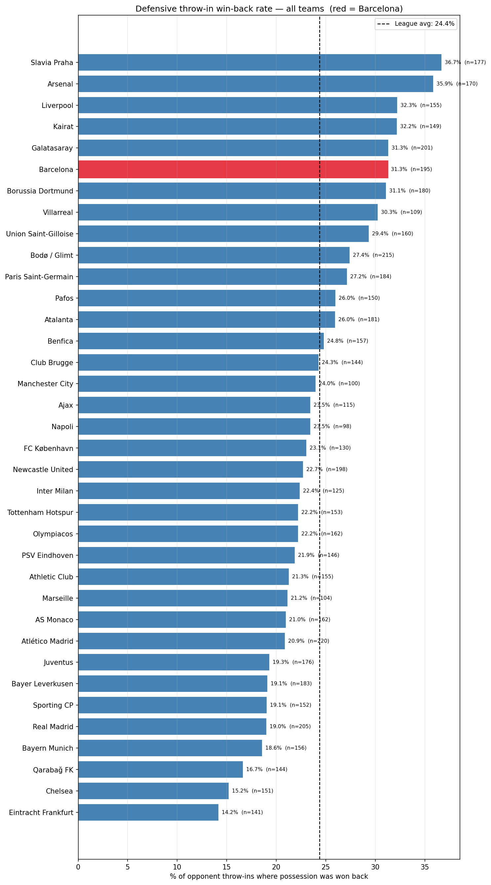

This success is not accidental. A look at Barcelona's positioning during opponent throw-ins reveals a clear, consistent system built on two complementary principles.
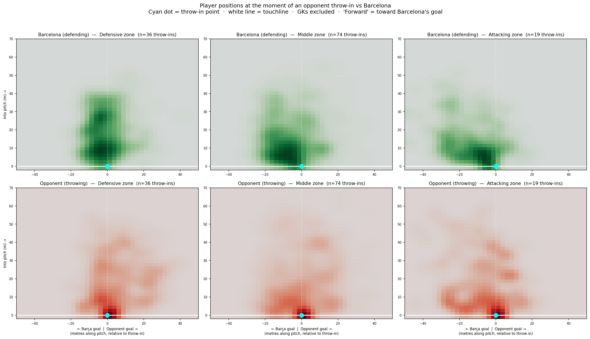

**Pressing the ball and blocking the central corridor.** Barcelona applies immediate pressure close to the throw-in taker while simultaneously occupying the middle corridor of the pitch. Together, these two actions leave the opponent with only one viable option: playing the ball along the sideline. The consequence is visible in the data — Barcelona concedes the fewest side changes of any team when defending opponent throw-ins.
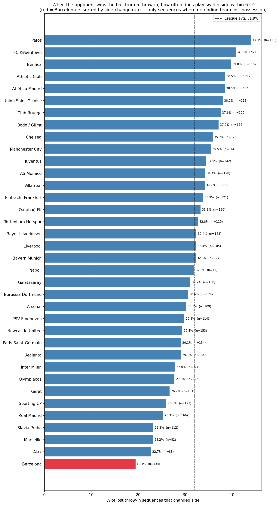

The system is effective even when Barcelona does not win the ball back directly. In those cases, opponents still rarely manage to switch the side of play or penetrate through the central channel.
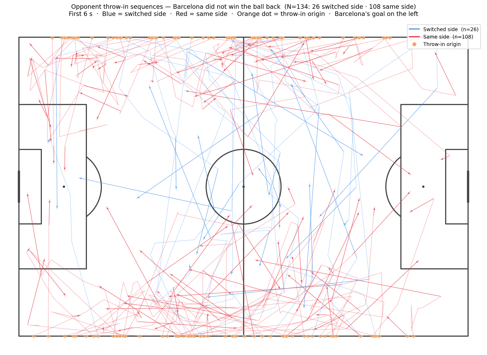

The win-back pattern is most pronounced in Barcelona's own defensive third. When the opponent plays into a central area in that zone, Barcelona tends to recover the ball.
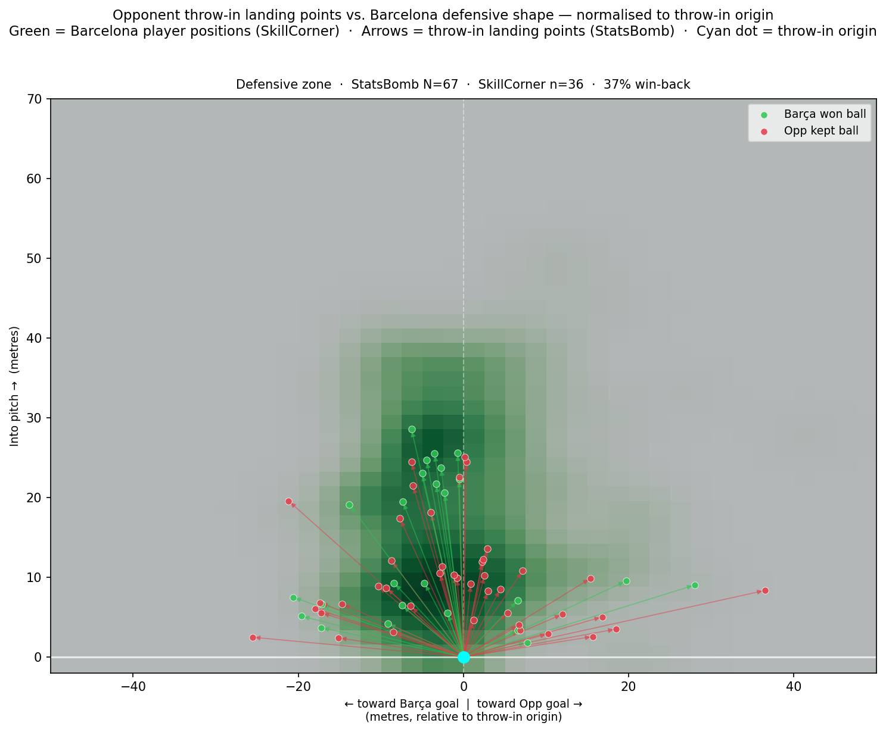

**Individual roles: man-marking meets zonal coverage.** The individual winback situations reveal a clear structure. Barcelona man-marks tightly close to the throw-in while maintaining zonal coverage further back. One detail stands out: at least one player positions himself directly beside the throw-in taker without marking a specific opponent. His role is to close down the thrower immediately after the ball is played, preventing a quick return pass and disrupting any continuation of the move.

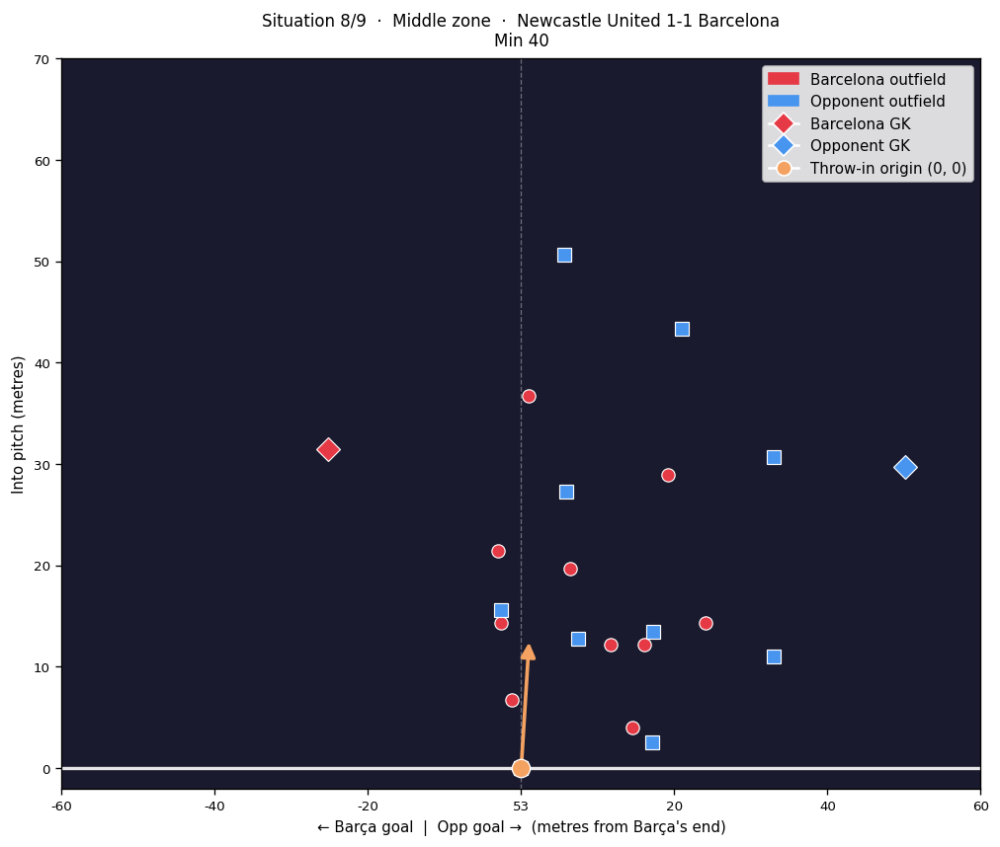
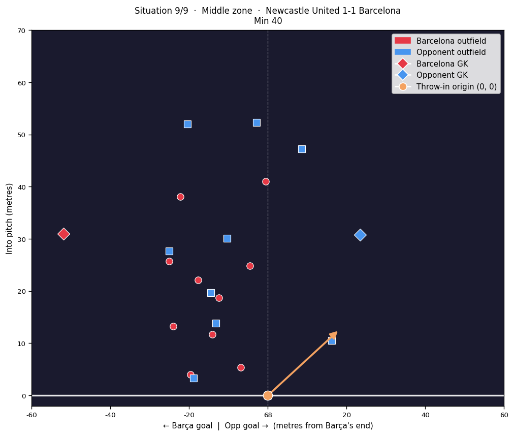

**Selective compactness.** Barcelona's proximity to opponents during throw-ins reflects this dual structure. While the average distance to the nearest opponent is broadly similar across teams, Barcelona stands out in its defensive and middle zones: the average of the five smallest distances per situation is 0.5 m below the league mean, while the five largest distances remain close to it. This is consistent with the system as a whole — tight man-marking on specific opponents, wider zonal coverage with the rest.
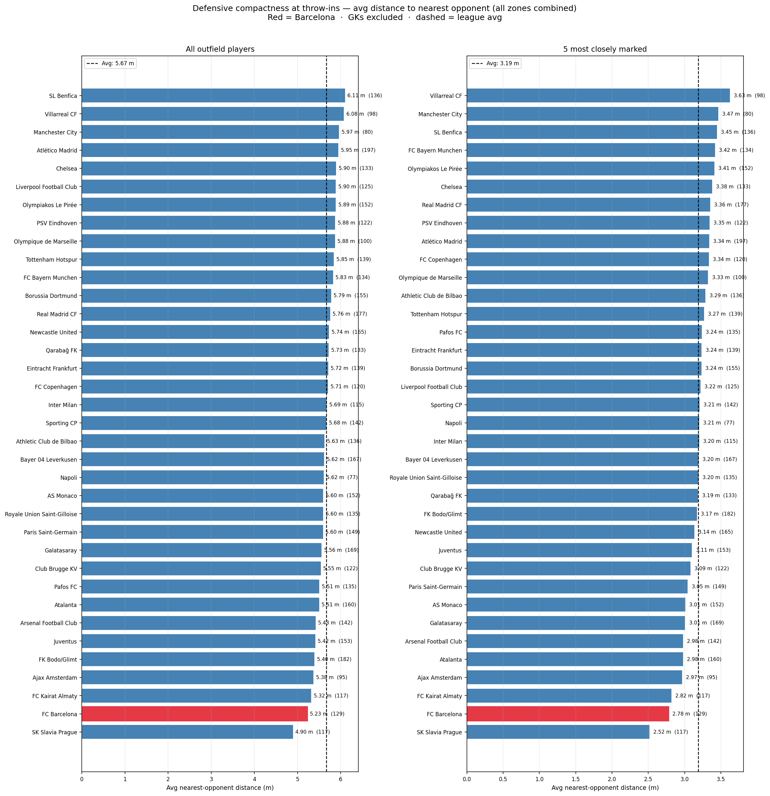

## Defensive Penalties

Barcelona conceded only one penalty across the entire Champions League campaign — making goalkeeper analysis largely redundant. The more interesting question is why: what about Barcelona's style keeps them out of penalty-conceding situations in the first place?
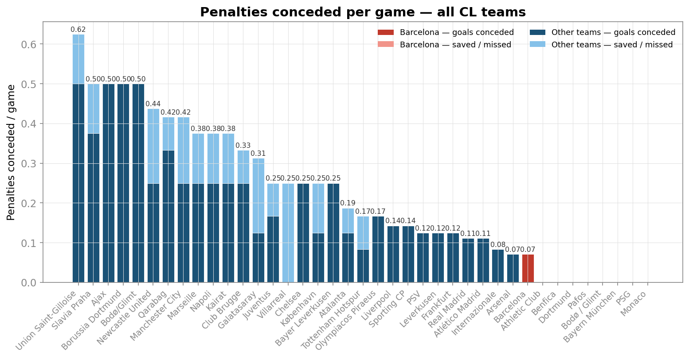

**Technical play reduces exposure.** The core explanation is that Barcelona's style avoids the situations that lead to penalties. A team that controls the ball cleanly in its own third rarely needs to commit the kind of desperate, contact-heavy challenges that referees punish. This shows up in pass completion: Barcelona ranks among the highest in the Champions League for pass completion in their own defensive third, and teams with higher completion rates tend to concede fewer penalties.
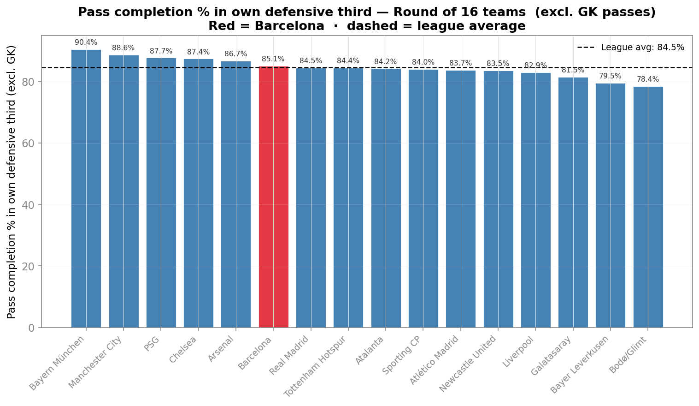
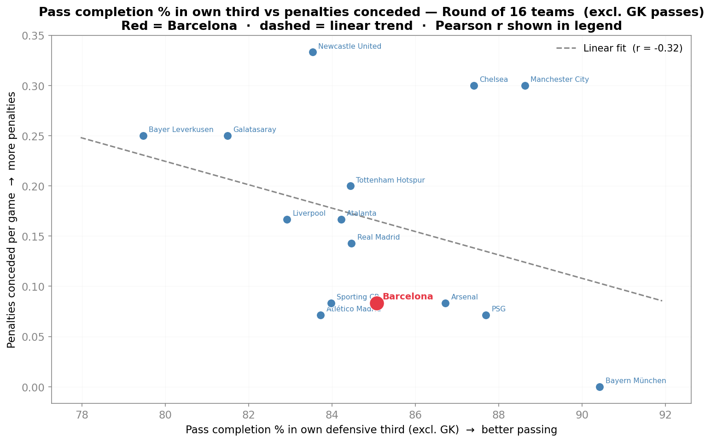

**Fewer fouls, fewer penalties.** The same logic applies to foul counts: a more aggressive playing style leads to more fouls overall, and more fouls create more opportunities for a penalty to be awarded. Barcelona commits fewer fouls per game than most of their Round of 16 peers, which is consistent with their possession-oriented, low-contact approach.
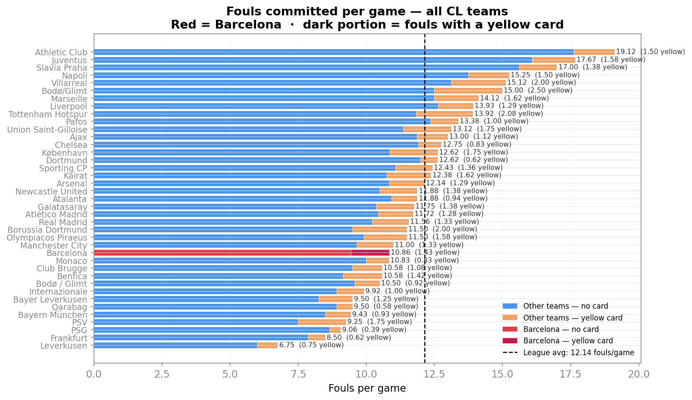
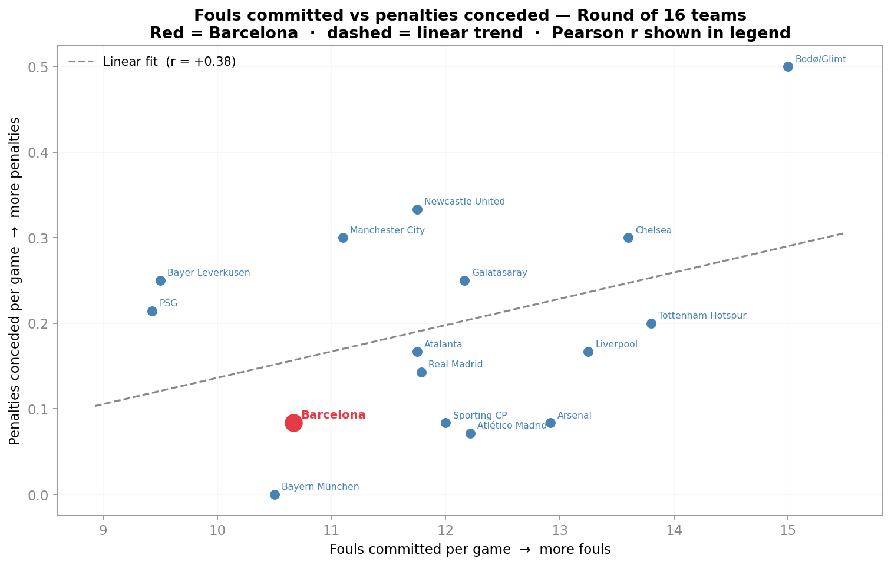
