## Offensive Analysis
### Offensive Corners

The first key finding is that Barcelona's corner strategy appears structurally distinctive, even if the overall output is not elite. 
Earlier overview results showed that Barcelona were below the competition average in attacking-corner xG, attempts, and goals.
However, the present visuals suggest that this does not reflect a random or underdeveloped corner approach. 
Instead, Barcelona seem to rely on a designed attacking model built around direct inswing deliveries, and a meaningful but secondary use of short corners and first-contact manipulation rather than through clear aerial dominance. 

This is already visible in the routine distribution. Of Barcelona's offensive corners, 38 were direct inswingers, 13 were short corners, 6 were other direct deliveries, and only 1 was a direct outswinger. 
This suggests that inswing corners form the default structure, while short corners serve as an important alternative. 
Barcelona therefore combine traditional delivery with selective short-corner routines to disrupt defensive organisation.

The efficiency metrics refine this picture. 
Barcelona generate more attempts per corner from short corners than the average team, whereas crossed corners produce fewer shots than average. 
A similar pattern appears in xG per corner: both routine types are slightly below average, but the gap is smaller for short corners.
This suggests that short corners are a relatively effective shot-creation mechanism for Barcelona, even if they do not fully compensate for the team's lower overall corner output. 
In this sense, short-corner routines may act as tactical approach to help offset Barcelona's weaker physical profile.

|                             Attempt Rate                             |                          xG per Corner                          |
|:--------------------------------------------------------------------:|:---------------------------------------------------------------:|
| 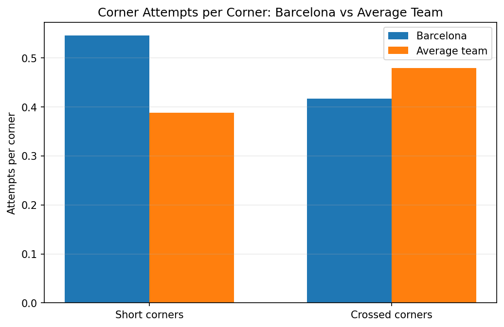 | 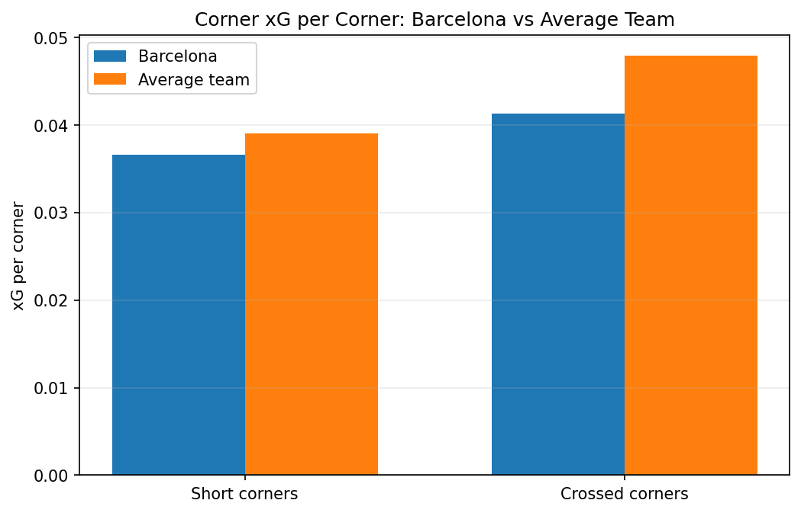 |
_Figure 1: Corner Attempt Rate and xG by first delivery distance (snippet $2865)_

#### Individual Players involved in Corner Action

Raphinha clearly dominates as the corner taker, indicating a high level of delivery execution consistency.
By contrast, receivers and first shooters are more widely distributed across several players, mainly Center Backs and Strikers.
This points to a strategy based on coordinated movement and role allocation rather than on one fixed aerial target. 
Delivery is standardised, but reception and finishing remain flexible.

|            Top Takers of Barcelona's Corners             |                  Top Receivers of Barcelona's Corners                  |
|:--------------------------------------------------------:|:----------------------------------------------------------------------:|
|  |  |
_Figure 2: Top Takers and Receivers of Barcelona's Corners (snippet $2866)_

The OBV comparison (Figure 3) adds a first indication of how much value these deliveries create at the individual taker level.
Raphinha's corners show a slightly positive mean OBV, but the median remains close to zero, which suggests that many of his corners do not immediately increase the attacking value, while a smaller number of stronger deliveries lift the average.
Marcus Rashford's distribution is more negative and less effective overall, although a few positive outliers show that individual deliveries can still create danger.
Lamine Yamal has the most promising profile in this plot: despite only taking 10 corners, his median and mean are both positive, and his upper range is clearly higher than for the other Barcelona takers.
This may indicate that his deliveries are more often connected to valuable attacking outcomes, but the small sample makes this interpretation tentative.
Compared with the tournament-wide distribution, Barcelona's main takers do not appear extreme outliers, but Yamal's profile and Raphinha's positive average support the idea that Barcelona's corner value depends on selected high-quality deliveries rather than consistently high value from every corner.

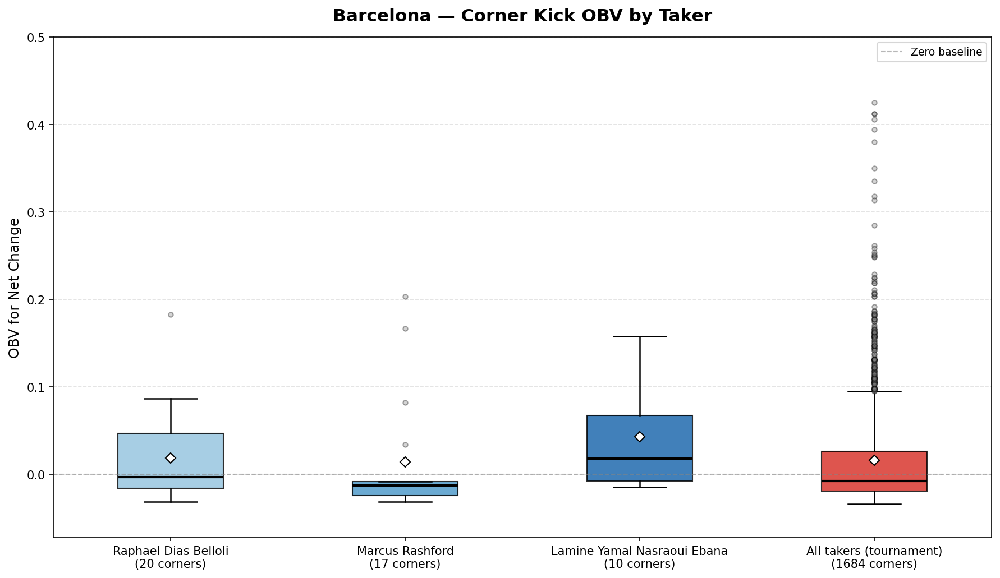
_Figure 3: Corner OBV by player (based on snippet $3008)_

#### Spatial Profile of Corner Delivery

The spatial maps deepen this reading of flexibility, illustrating clear but not exclusive tendencies for areas of delivery. 
Many deliveries are directed into the central six-yard area and near-post corridor, with a smaller overall share toward the far post, the edge of the box, and wider recycle zones. 
Barcelona therefore do not attack only one target area.
Interestingly, the far-post option seems to be a real option for right-side corners.
Instead, they appear to combine dangerous first-contact zones close to goal with the possibility of recycled possession or a second delivery.

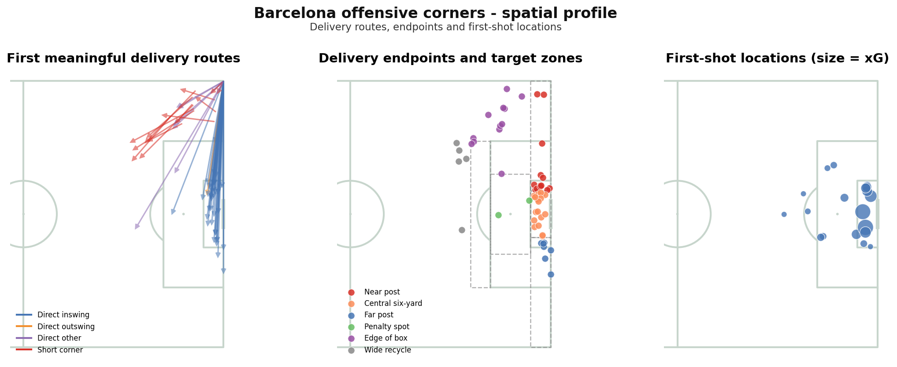
_Figure 4: Spatial Profile (normalized to left-side) - Two main target zones visible_

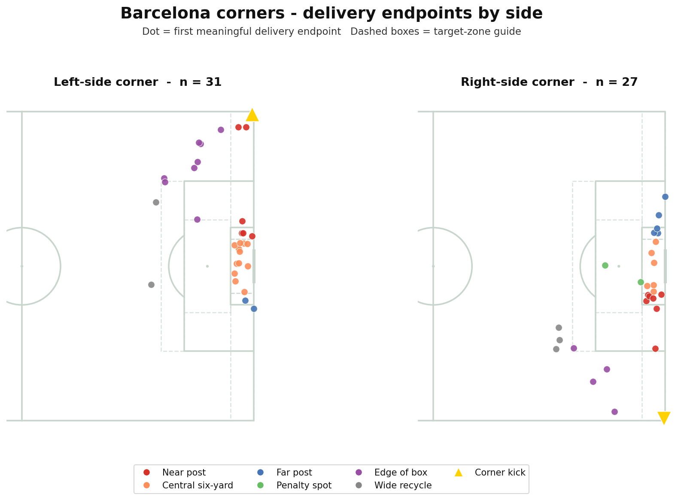
_Figure 5: Delivery endpoints by side - Long corners predominantly used from the right_

This is also reinforced by the map of first touches after offensive corners. 
After the initial contact, Barcelona usually (especially from the left side) continue the sequence with a pass-on or carry, especially from wider or more advanced positions.
Direct attempts (mostly headers) are rather common when right-side corners are executed.
This suggests that their corners should not be evaluated only through the first header or shot, as an important part of the attacking value emerges in the second phase, which even might be decoupled from the initial corners xG etc. values.
The goal-sequence maps illustrate this clearly. 
The presented goal result from multi-action sequences rather than direct finishes from the original delivery. 
This supports the broader interpretation that Barcelona's corner strategy is based less on raw aerial superiority and more on controlled second-phase construction.

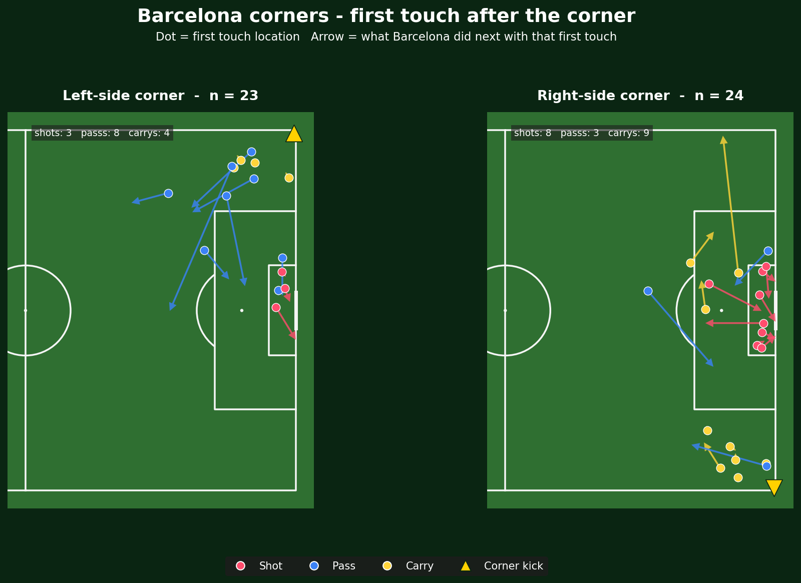
_Figure 6: First Touch Map - Sequences often continue with pass-on or carry (snippet $2863)_

The far-post-share plot adds a potentially interesting contextual detail regarding physicality and corner strategy. 
Barcelona's use of the far-post zone appears to increase particularly against the most extreme opponents in terms of height, namely Newcastle, by far the tallest team in the competition, and Copenhagen, the only shorter team with a height disadvantage in their match against Barcelona.
Although the sample is limited, this supports the idea that Barça may use the far post to avoid central aerial duels when in clear height disadvantage combined with a path strategy and to exploit their advantage against shorter teams.
This observation is particularly significant, as in all other games, corner were never delivered to the far-post.
That changed in the quarterfinals against Atlético Madrid, where far-post corners were again used as mathod.

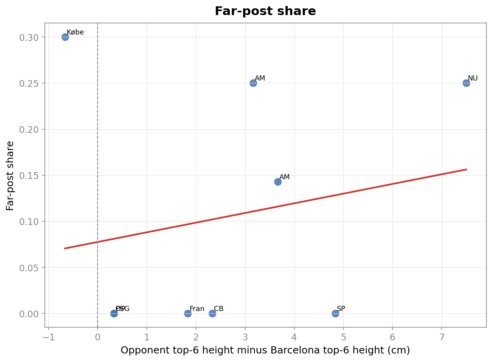
_Figure 7: Share of far-post Corners - Selected strategy against Copenhagen (Kobe), Atlético (AM) and Newcastle (NU) (snippet $2867)_

To conclude this subsection, we return once more to the individual level in order to add more context to the pure OBV comparison, where Lamine Yamal and then Raphinha appeared as the most favourable takers. 
The delivery maps, with all corners normalised to one side, show that the three main takers follow broadly similar principles: short options are available, but the central area close to goal remains the dominant target zone. 
At the same time, the reasons behind their value seem slightly different. 
Yamal's strong OBV profile may partly benefit from his larger share of short corners, which can protect possession and create positive continuation value without immediately requiring a high-risk aerial delivery. 
Raphinha, by contrast, appears more connected to direct chance creation: he produces the largest share of possession-to-shot outcomes and the highest xG from his corners, both in total and per corner. 
He is also the only taker clearly associated with far-post deliveries, which links back to the earlier finding that the far post may function as a specific tactical weapon in selected matchups. 
This suggests that Yamal's corner value is more continuation-oriented, while Raphinha remains the most productive executor for more direct and varied attacking deliveries.

|                                Raphina                                |                          Marcus Rashford                          |                             Lamine Yamal                              |
|:---------------------------------------------------------------------:|:-----------------------------------------------------------------:|:---------------------------------------------------------------------:|
| 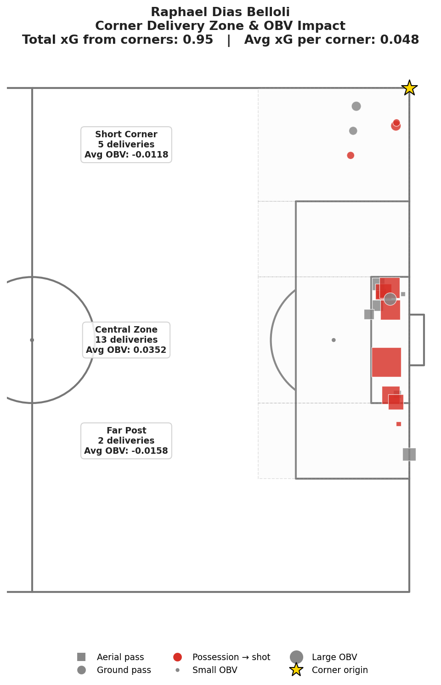 | 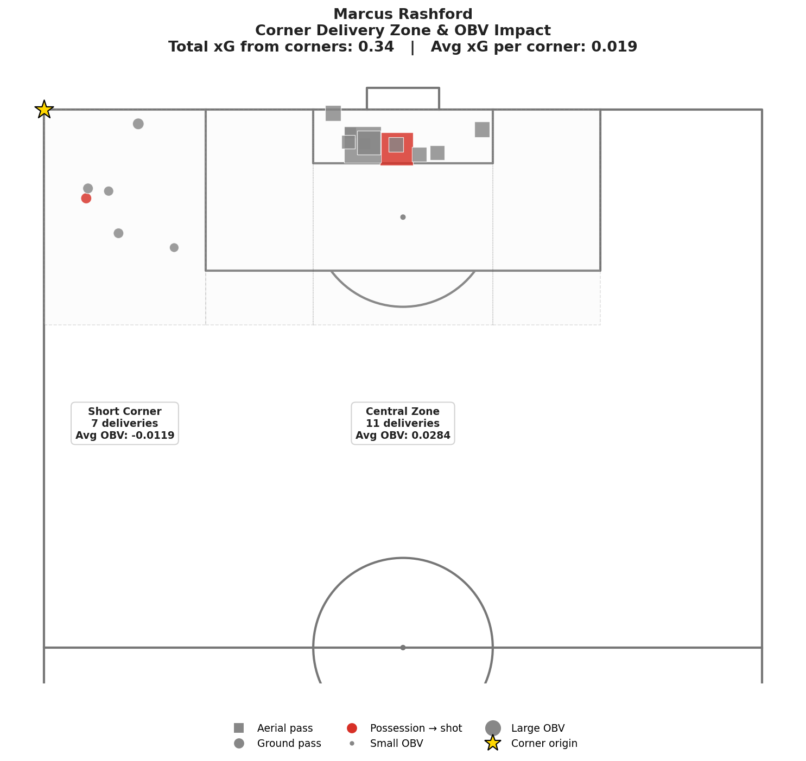 | 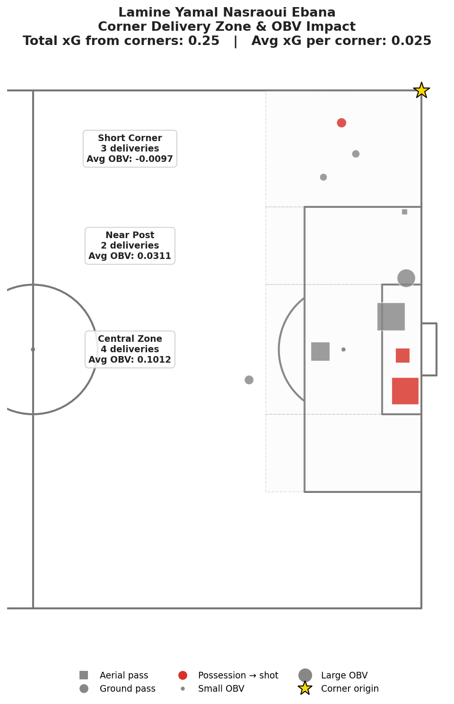 |
_Figure 8: Corner Impact Profile (OBV / xG) by player (based on snippet $3012)_

#### Attacking Players Movements

Four particularly informative visualisations were selected for closer offesive corner movement analysis: two corner situations against Copenhagen and Praga that led to attempts, one corner against Newcastle that did not result in an attempt, and the goal sequence against Frankfurt.
We generated the corner movement maps using snippet $2864.
The major part of all corner visualisations made suggests that Barcelona's offensive corners are generally built on compact occupation and small coordinated adjustments, rather than on large, highly dynamic pre-delivery movement.

The visualised corner against Sparta Praha can be seen as one typical example:

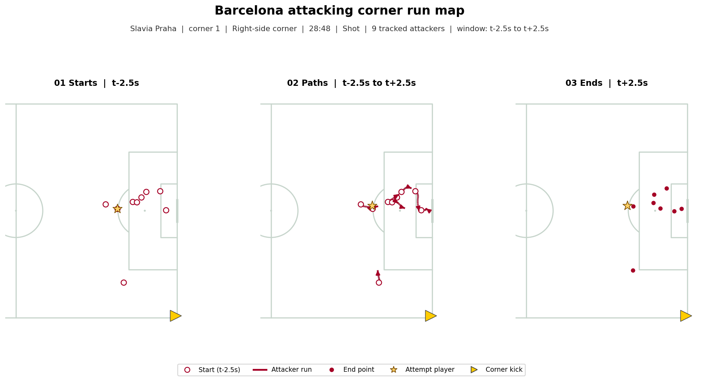
_Figure 7: Corner Routes vs. Sparta Praha - Minimalistic Movements; created second-row attempt_

Compared with the more patterned three examples against, the attackers show only limited displacement from their starting positions, and the routine appears to depend more on maintaining box occupation than on actively reshaping it. 
This supports the idea that Barcelona often prefer positional control over exaggerated choreography. 
Their corners are therefore not always built around dramatic decoy runs or sweeping movements across the box, but often around a more stable arrangement from which several players can attack the delivery or react to a second ball.

In the Copenhagen and the Newcastle examples below, the clearest pattern is a dense initial occupation of the six-yard box and near-post corridor, followed by short, curved, mainly vertical or diagonal runs into the goal area. 
The movement is compact rather than expansive and is designed to create separation in a very limited space, but definitely a distinct strategy to free a player at the far-post and put the defense into movement towards the goal.

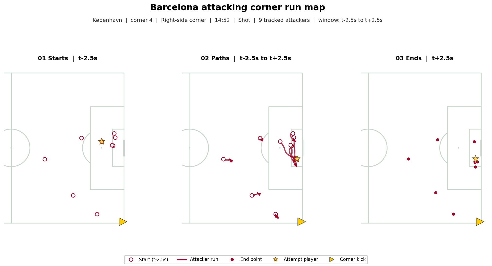
_Figure 8: Corner Routes vs. Copenhagen - Movement to the near post; no attempt_

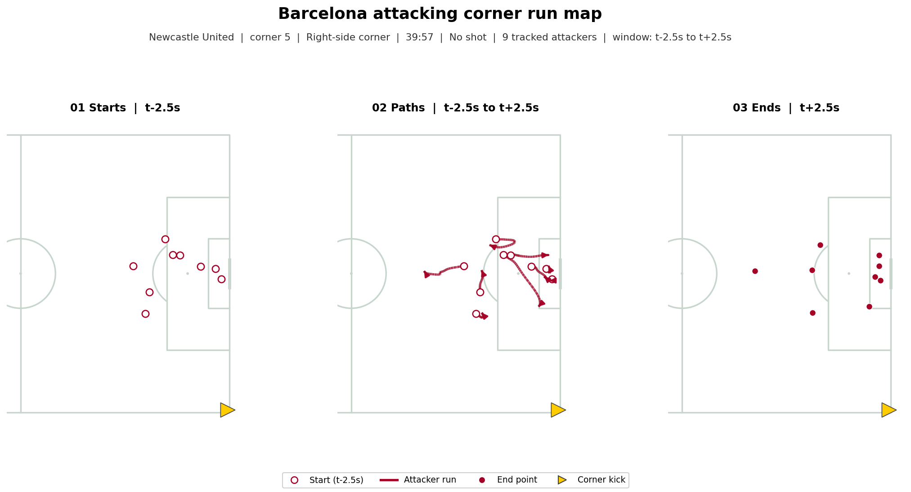
_Figure 9: Corner Routes vs. Newcastle - Movement towards the goal; near-post header_

The goal against Frankfurt provides the clearest example of how Barcelona can add a stronger manipulation layer to this compact structure using their short-played alternative. 
Here, the initial box occupation is again dense, but the subsequent movements show a more purposeful attempt to crowd the first zone, occupy defenders, and open a finishing space for the second action. 
Rather than aiming for a clean direct finish from the initial delivery, the routine creates a favourable central situation through congestion, redirection, and continuation of the sequence. 
This is consistent with the earlier goal-sequence maps, which already indicated that Barcelona's goals from corners often emerge through more than one action rather than from a straightforward first-contact header.

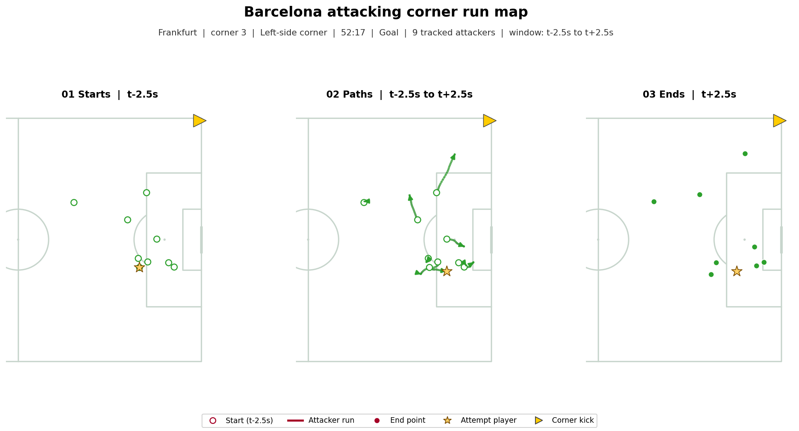
_Figure 10: Corner Routes vs. Frankfurt - Short corner and spreading routed; goal_

Taken together, these movement maps suggest that Barcelona's offensive corner strategy is best described as compact, controlled, and sequence-oriented. 
Most routines rely on short, well-timed adjustments from a dense starting structure, while only some sequences show more clearly choreographed movement patterns. 
This interpretation fits the broader findings of the report. Barcelona's corners are not especially strong because of high volume, exceptional corner xG, or superior physicality. 
Instead, their attacking value appears to come from the way they use local overloads, selective movement, and continuation after the first contact to create opportunities.

### Offensive Free-kicks

FC Barcelona's attacking free kicks provide a positive signal in the set-piece data.
As mentioned in our statistical overview they rank above average in the main production metrics: 
they scored 3 goals from free-kick sequences, compared with a league average of 1.94, generated shots from 50.0% of their free kicks compared with 45.2% on average, and accumulated 2.46 xG, clearly above the league mean of 1.79.
Their goal rate per free kick, however, is almost identical to the competition average.
This makes the profile more convincing, because the advantage is not primarily explained by unusually efficient finishing, but by Barcelona reaching shooting situations and accumulating chance quality more consistently than most teams.

The routine breakdown (Figure 11) shows that this production comes from a mixed free-kick approach rather than from one dominant pattern.
Most of Barcelona's attacking free kicks are classified as other indirect routines, followed by crosses into the box, short free kicks, and direct shots.
The different routine types serve clearly different purposes.
Direct free kicks are the most immediate route to a attempt on goal, while crosses into the box offer the strongest balance between usage, shot creation and xG.
Short free kicks, understandably, contribute little direct xG, as this number includes free-kicks all over the pitch.
Here the late analysis in context of possession quality improvement is important.

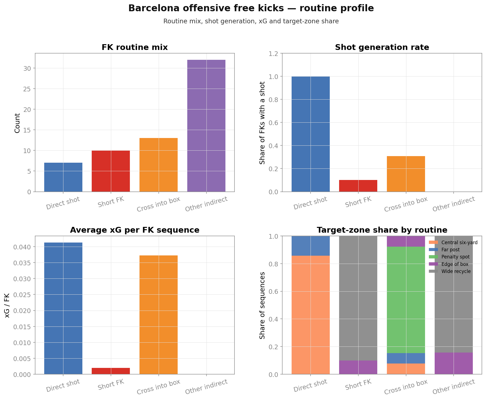
_Figure 11: Offensive free-kick routine profile of FC Barcelona_

The origin-zone analysis (Figure 12) adds a more cautious but useful tactical perspective.
Because the number of Barcelona free kicks in several zones is small, the values should not be interpreted as stable evidence for fixed preferences.
However, comparison with the league average still helps to identify tendencies.
From long distances, especially in wide and central areas between 30 and 50 metres from goal, Barcelona record many free kicks that fall into the other indirect category.
These situations can be understood as free-kick attempts without a clearly visible organised attacking routine.
In these zones, Barcelona therefore appear less likely to force a structured delivery than to restart play, keep possession, or move the ball into a better attacking shape.

Closer to goal, the pattern changes.
In central and channel positions, Barcelona more often select routines that are directly connected to shot creation, either through direct shots or crosses into the box.
This is most visible in the 20–30 metre central zone, where Barcelona use direct shots and crossed deliveries more frequently than passive restarts.
A similar tendency appears in the channel zones, where the team seems more willing to create an attempt once the free kick offers either a shooting angle or a realistic delivery angle into the penalty area.
This supports the idea that Barcelona's free-kick approach is selective: not every restart is treated as a designed attacking routine, but more dangerous origin zones trigger more purposeful solutions.

The xG values remain modest and, in most zones, Barcelona are below the league average.
This again limits strong conclusions, especially because single events can have a large influence in such small samples.
Still, the channel area from 30 to 50 metres stands out as Barcelona's most productive zone in this plot.
Here, they generate higher xG per sequence than the league average and also choose organised routines more often, with crosses and short free kicks appearing alongside fewer purely indirect restarts.
This suggests that Barcelona may be relatively effective when they can attack the box diagonally from deeper channel positions, where the delivery angle allows them to target dangerous spaces, a finding of the literature review.

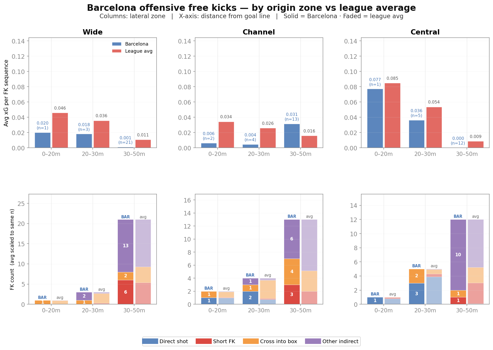
_Figure 12: Offensive free-kick routine profile of FC Barcelona by origin zone_

#### Individual Players involved in Free-kick Action

The player-role distribution for free-kicks in the opponent's half shows a clear contrast to the corner section.
While corners were mainly delivered by Raphinha, offensive free kicks are spread across a much wider group of takers. 
Marcus Rashford leads the list with 9 free kicks (he takes most of the direct approaches), followed closely by Pedri, Lamine Yamal, Frenkie de Jong, Raphinha and Eric García. 
This suggests that free-kick responsibility is more situational and depends strongly on field position, footedness and routine type rather than on one fixed specialist. 
The receiver profile is more concentrated and dominated by defensive players, especially Eric García, Pau Cubarsí, Gerard Martín, Araújo, and Koundé. 
This indicates that when Barcelona use free kicks as deliveries into the box, they often rely on centre-backs and physically stronger players as first-contact targets, while the taker role remains more flexible.

|                Top Takers of Barcelona's Free-kicks                |              Top Receivers of Barcelona's Free-kicks               |
|:------------------------------------------------------------------:|:------------------------------------------------------------------:|
| 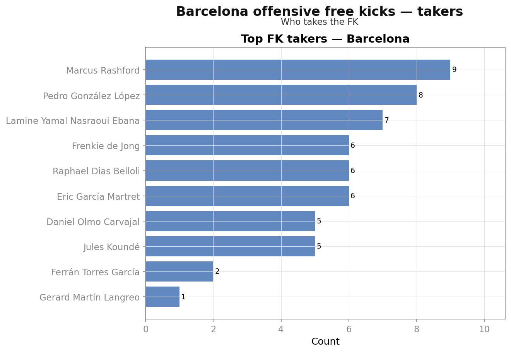 | 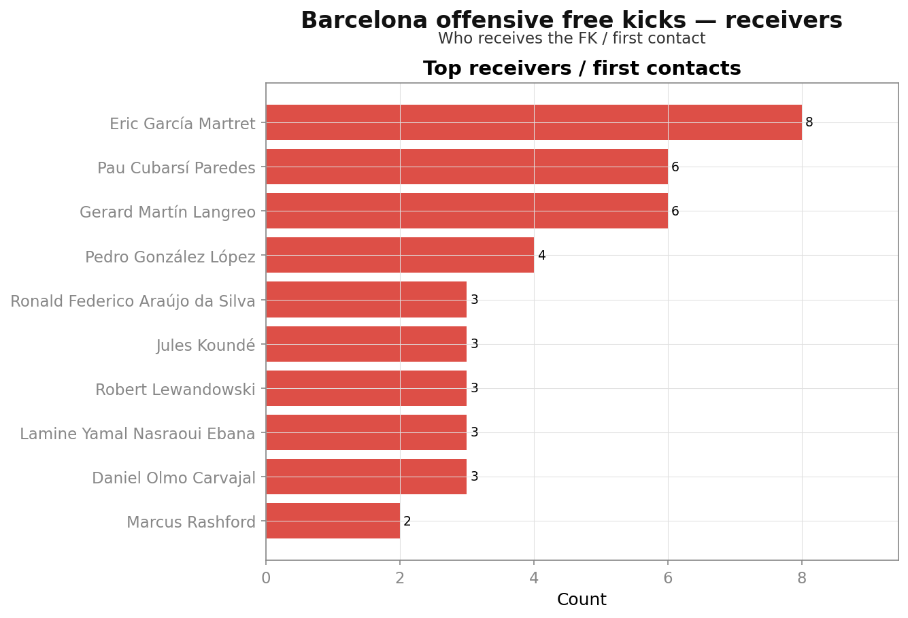 |
_Figure 13: Top Takers and Receivers of Barcelona's free-kicks_

Compared with corners, the free-kick OBV profiles (Figure 14) are generally closer to zero, which is plausible because many free kicks in the opponent's half are not immediate chance-creation situations.
Pedri's free kicks show the most stable positive tendency, although the values are very small, suggesting that his routines often improve the attacking state slightly rather than creating direct danger.
Raphinha has the widest distribution among Barcelona's takers, with both positive and negative outcomes, which fits his more varied role across different free-kick situations.
By contrast, Rashford and Lamine Yamal show more negative average profiles in this plot, likely reflecting that their free kicks include more direct or higher-risk attempts, where unsuccessful actions are immediately punished by OBV.

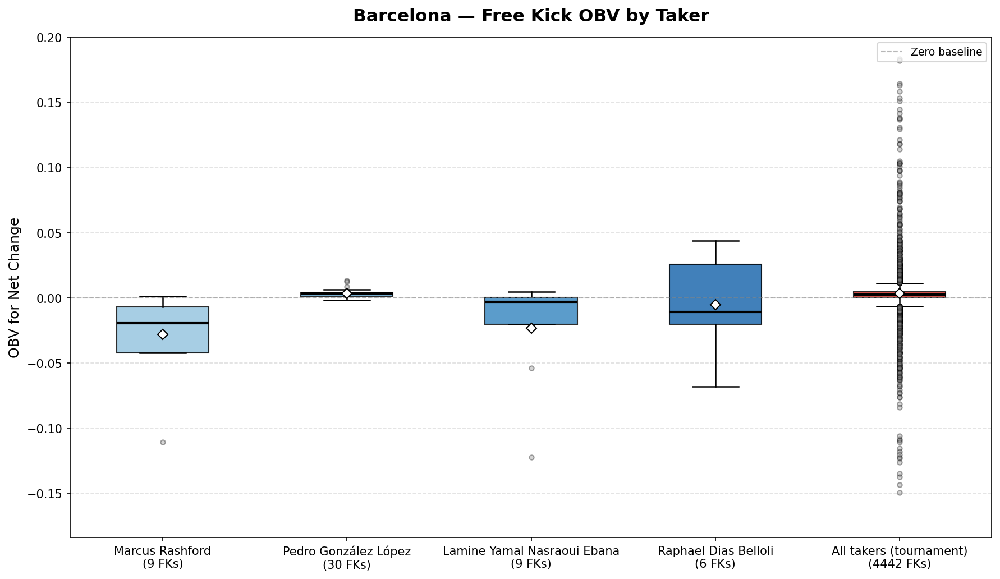
_Figure 14: Free-kick OBV by player (based on snippet $3008)_

The individual free-kick maps (Figure 15) show that the different takers are connected to different types of attacking value, in contrast to similar corner profiles.
Rashford's profile is dominated by direct or semi-direct attempts from central zones around the edge of the box, which explains why his free kicks create some xG but show rather negative OBV values when these attempts do not lead to a strong outcome.
Lamine Yamal's free kicks are more scattered and include deeper or wider restarts, with only limited direct xG production, so his profile appears less clearly tied to one productive routine.
Raphinha, despite the smaller sample, stands out again in terms of output: his free kicks generate the highest total xG and average xG per free kick among the three shown, mainly through deliveries into the penalty-spot area and possession-to-shot sequences.
This supports the earlier interpretation that Barcelona's free-kick roles are situational, but it also suggests that Raphinha is the most productive taker when the routine is designed to attack the box

|                                  Raphina                                   |                            Marcus Rashford                             |                                           Lamine Yamal                                            |
|:--------------------------------------------------------------------------:|:----------------------------------------------------------------------:|:-------------------------------------------------------------------------------------------------:|
| 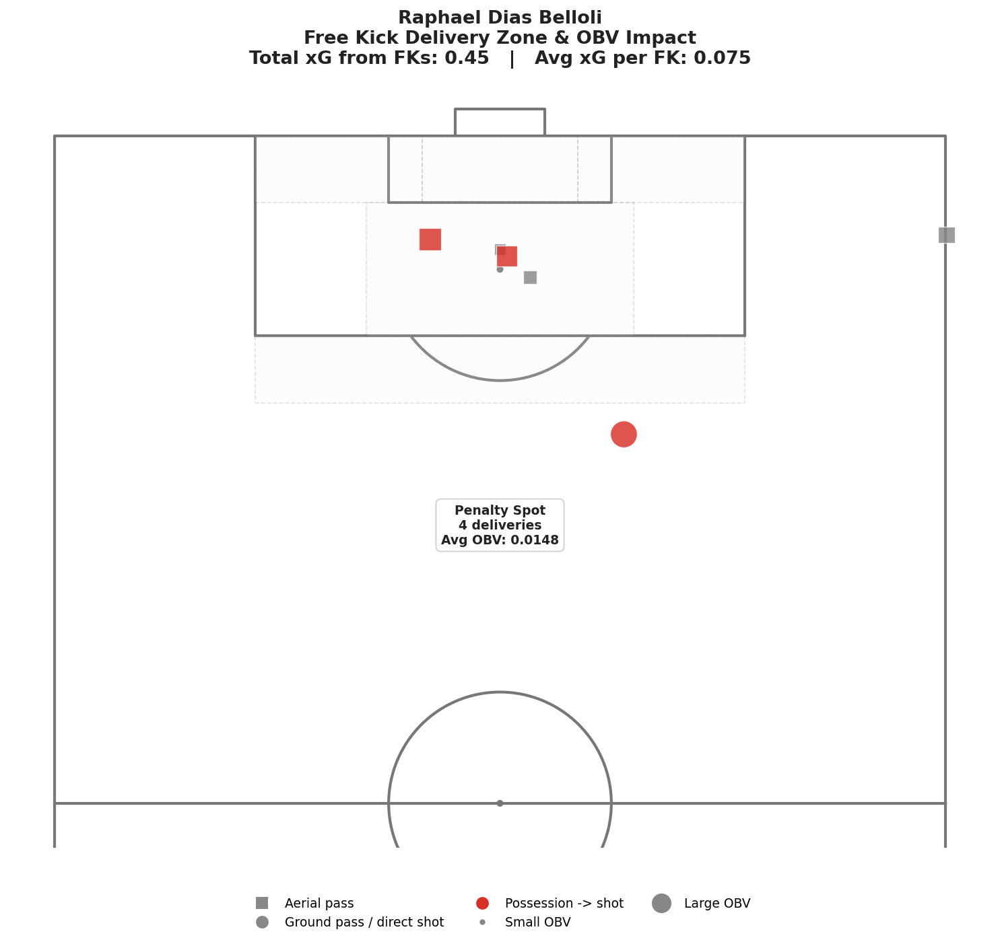 | 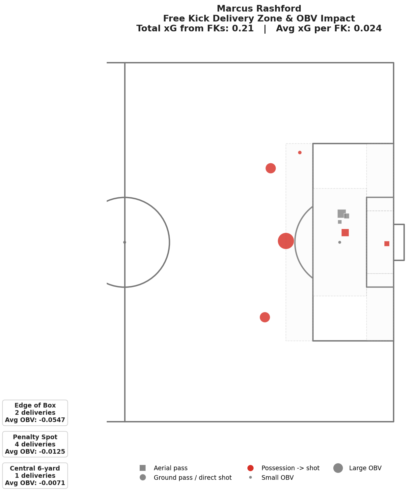 |            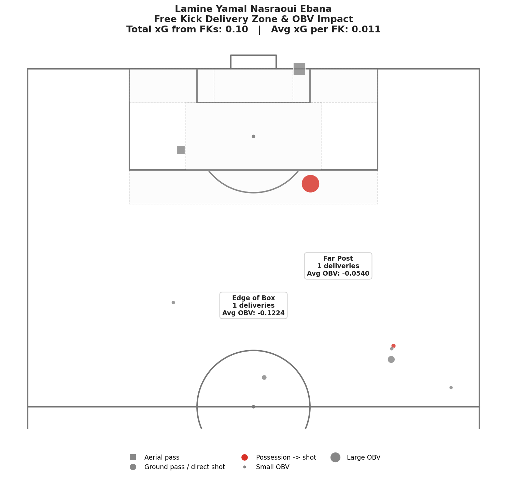             |
_Figure 15: Free-kick Impact Profile (OBV / xG) by player (based on snippet $3012)_

#### Spatial Profile of attempt-oriented Free-kick Delivery

Subsequently, we analyse the free-kick routine types that are connected to attempt creation: direct and crosses into the box.
The aim is to identify whether specific tactical patterns become visible.
We compare these observations with the patterns already found for corners and interpret the results in relation to the hypotheses from the literature review, especially regarding structured deliveries, second-phase value, and Barcelona's use of set pieces to create danger without relying only on aerial dominance.

For free kicks crossed into the box (Figure 16), Barcelona show a delivery pattern that is closely connected to the mechanisms discussed in the literature review.
Most deliveries are played diagonally from wider or deeper half-space areas into the central penalty area, especially around the penalty spot, rather than directly into the six-yard box.
Such approaches match the delivery pattern of Rashford and Raphina.
This supports the review finding that comparable indirect free kicks should be understood together with corners, because they can also be used to attack organised defensive structures through delivery angle, runner separation, and second-ball potential.
At first glance, however, the pattern is slightly different from corners: while corners more often targeted the central six-yard and near-post zones, crossed free kicks seem to create danger from a somewhat deeper central reception zone.
The resulting shots are limited in number, but they come from central areas, suggesting that these routines are not only simple crosses.
The goal against Newcastle visible in the plot is such an example.

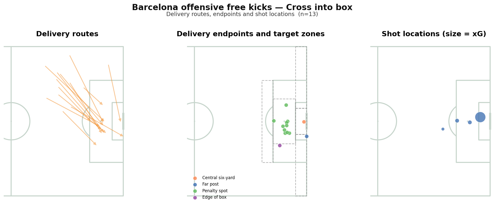
_Figure 16: Spatial profile of free-kicks crossed into the box_

The free-kick goal against Newcastle shows a successful pattern that was already identified in the corner analysis.
Again, Barcelona use the initial delivery to move the opponent's defensive line and create a more favourable second action.
In this case, the ball is not played towards the far post, but into a deeper central area.
Lewandowski's rehearsed lay-off header then redirects the sequence into a higher-value finishing situation, which finally leads to the goal.
This suggests that the underlying principle is similar across corners and indirect free kicks: Barcelona do not only search for a direct first-contact finish, but often use the first contact to manipulate the defensive structure and create the decisive action afterwards.

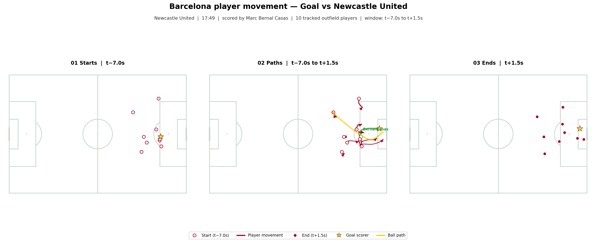
_Figure 17: Free-kick Routes vs. Newcastle - deep kick, deep routes, short header assist; goal_

For direct free kicks (Figure 16), the connection to the initial tactical hypotheses is weaker, because this routine type of course depends on individual execution.
The attempts are mostly taken from central half-left positions and are aimed towards the near corner.
Although the sample is small, these attempts generate a noteworthy share of xG and include the goal against Copenhagen.

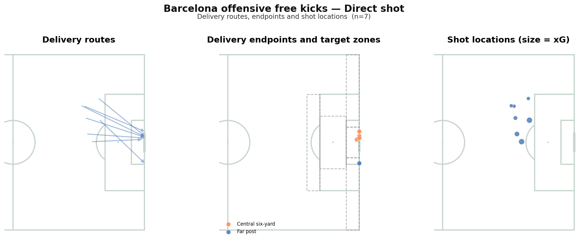
_Figure 18: Spatial profile of direct free-kicks_

#### Free-kicks From the "Dead Zone"

After analysing deliveries that are directly oriented towards shot creation, this subsection focuses on how FC Barcelona try to transform free kicks from the “dead zone” into improved attacking situations.
Here, the dead zone refers to free kicks outside the own defensive third, but still far enough away from goal that an immediate shot or direct box delivery is usually not the most promising option.
Instead of evaluating these situations through xG, which would miss many possession-improving actions, we analyse the OBV change after free kicks taken by the players with the most executions from this zone.
This allows us to assess whether Barcelona use these restarts merely to continue possession, or whether certain players are able to create measurable attacking value by moving the ball into more favourable game states.

In Figure 19 we illustrated the OBV outcome in maps of all free-kicks by the six players, executing them most often in the "dead zone".
According to the still possession-oriented Barça style they suggest that these restarts are less about immediate chance creation and more about controlled progression into better attacking states.
Across all players, the OBV gains are small in magnitude, so the differences should not be interpreted as strong individual quality rankings.
Still, some role patterns are visible. Pedri and Frenkie de Jong mainly use these situations to circulate or switch the point of attack, often through diagonal passes that move Barcelona away from the pressure zone. Frenkie produces the highest mean OBV among the outfield players shown (+0.0043), which seems to come from more ambitious switches and forward diagonals into the opponent's half. Pedri's profile is slightly safer, with 23 positive actions from 25 passes, indicating a very stable but less explosive way of improving possession value.

The centre-backs show a different profile. 
Araújo and Eric García often restart from deeper positions and play more vertical or line-breaking passes, which can carry slightly more risk but also help Barcelona escape pressure and move the block forward. 
Eric García's profile is especially clean, with 16 positive actions from 17 passes and a mean OBV of +0.0034, suggesting that his restarts are usually conservative but effective. 
Gerard Martín is also positive on average, but his map looks more locally oriented, with several passes staying within the same side or nearby corridor rather than clearly switching the field.
Joan García has a special role because his dead-zone free kicks often start from very deep areas close to Barcelona's own box. 
His passes are longer and more varied, including several large switches and forward balls into advanced zones. He has the highest mean OBV in this group (+0.0045) and no negative actions, although this should be interpreted carefully because goalkeeper restarts are structurally different from outfield free kicks.

Overall, the most valuable players for turning dead-zone free kicks into better situations appear to be Joan García, Frenkie de Jong, and Pedri, but for different reasons: Joan García through long distribution and field switching, Frenkie through progressive diagonals, and Pedri through safe, consistent possession improvement. 
This supports the broader interpretation that Barcelona treat these free kicks as positional tools: they are used to reset structure, change the side of attack and move the ball into more favourable zones rather than to attack the goal directly.

|                      Frenkie de Jong (CM)                       |                               Pedri (CM)                               |                          Joan García  (GK)                          |
|:---------------------------------------------------------------:|:----------------------------------------------------------------------:|:-------------------------------------------------------------------:|
| 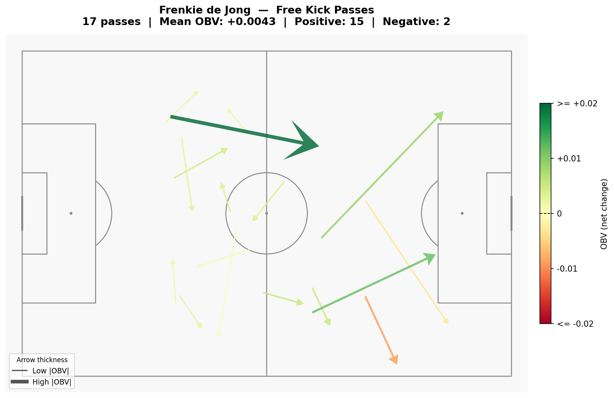 | 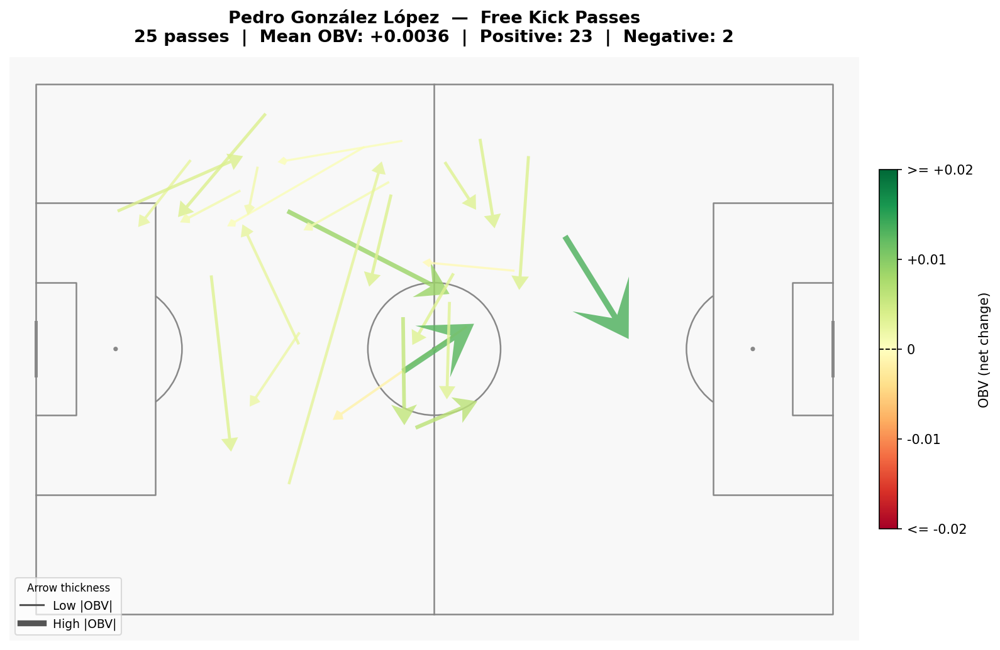 | 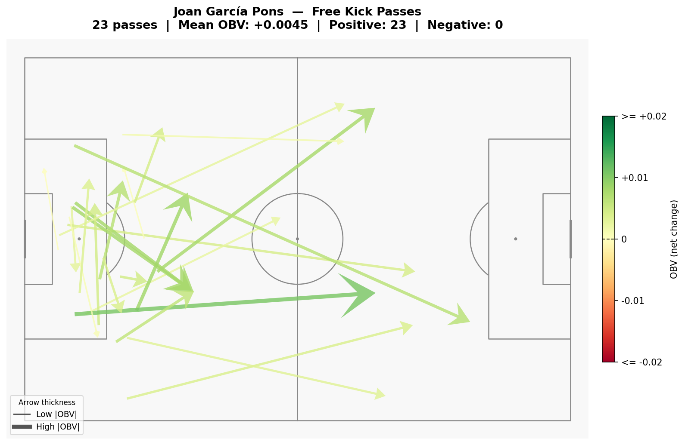 |

|                          Gerard Martín (CB)                           |                       Ronald Araújo (CB)                       |                          Eric García (CB)                           |
|:---------------------------------------------------------------------:|:--------------------------------------------------------------:|:-------------------------------------------------------------------:|
| 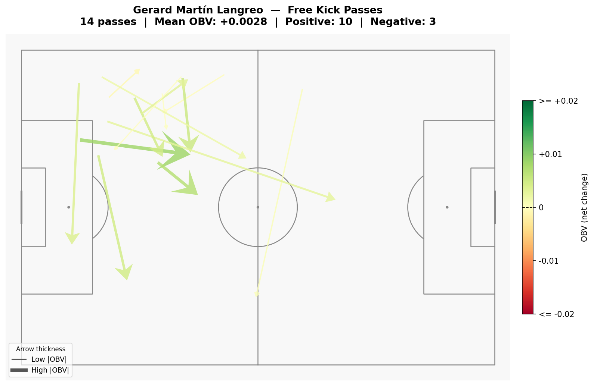 | 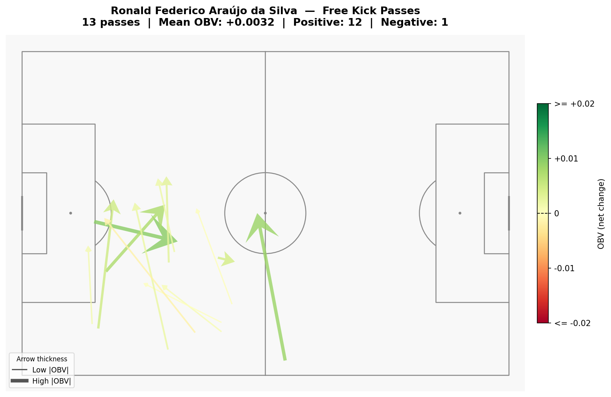 | 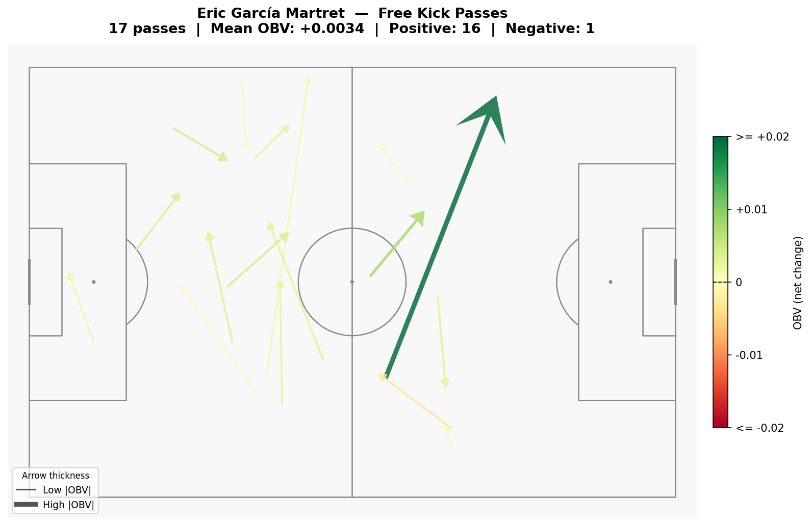 |

_Figure 19: Dead-zone free-kick passes coloured by OBV (green = positive, red = negative; arrow thickness scales with |OBV|)_

### Throw-ins
Unsurprisingly, Barcelona's throw-in profile reflects their broader possession-oriented identity rather than a distinct set-piece weapon. Across all throw-ins in the competition, the team retains the ball substantially more often than the league average, but the more granular views suggest that this advantage is best understood as a positional and structural one rather than as a direct attacking mechanism.
Figure 20 illustrates this clearly. When the first five passes after a throw-in are evaluated, Barcelona lose possession in only 38.1% of cases, compared with a league average of 53.2%. The remaining throw-ins are roughly evenly split between possession kept on the same side (31.4%) and possession kept after a side change (30.4%), whereas the league average distributes only 21.9% and 24.9% to these two retention categories. Barcelona therefore not only retain possession more reliably, but also use throw-ins as a flexible restart that can either consolidate the side of attack or actively shift the point of play. This dual profile is consistent with the idea that throw-ins, like free kicks in the dead zone, function as positional tools designed to improve the attacking state rather than to generate immediate chances.
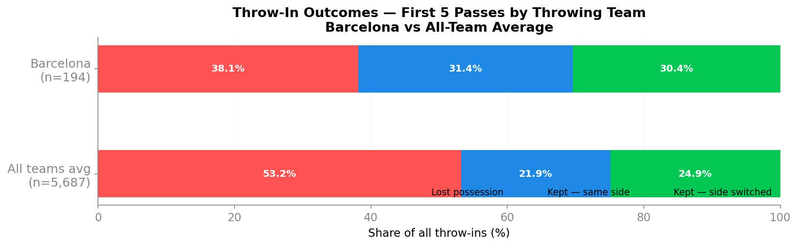
_Figure 20: Throw-in outcomes within the first five passes — Barcelona vs. all-team average_

The defensive-half retention view (Figure 21) refines this reading. With a five-second retention window, Barcelona retain possession on 82.4% of own-half throw-ins (n=101), which is above the competition-wide average of 79.7% but clearly below the leading group around Bayern Munich, Manchester City and Napoli, all close to 90%. This contrast is interesting because it suggests that Barcelona's strong overall throw-in profile is not primarily explained by exceptional ball security under pressure in their own half. Instead, it seems to emerge from how they continue and structure possession after the initial retention, rather than from elite first-action robustness against high-pressing opponents. In other words, Barcelona are solid but not outstanding at simply surviving a throw-in deep in their own half; the larger gap to the league average in Figure 20 appears to be driven by what happens in the passes that follow.
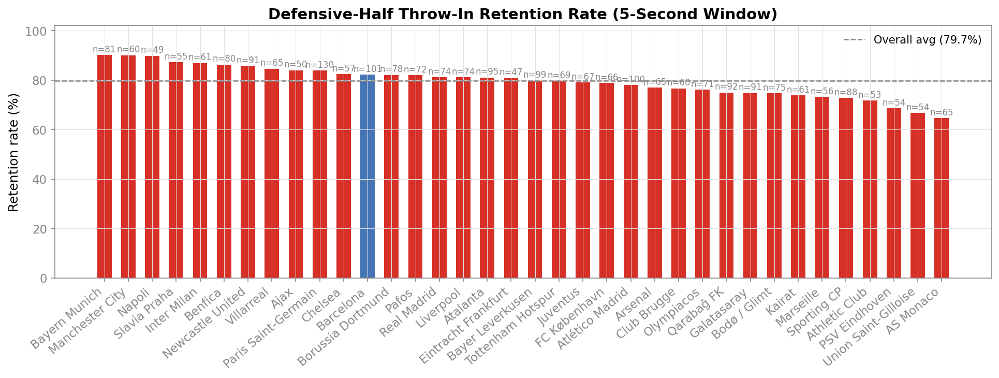
_Figure 21: Defensive-half throw-in retention rate within a five-second window_

This interpretation is supported by the trajectory map of Barcelona's own-half throw-ins (Figure 22). When Barcelona retain possession within the six-second window, they switch the side of attack in 43.9% of cases. The visualisation shows that many of the green trajectories travel diagonally across the pitch, often through deeper central or back-line zones, before reappearing on the opposite flank. The blue same-side trajectories, by contrast, tend to stay more locally within the corridor of the original throw-in. Lost-possession sequences (red) are concentrated, but not exclusively located, in the more advanced zones of the own half, where the throw-in is taken closer to halfway and ball circulation is more likely to face organised pressure.
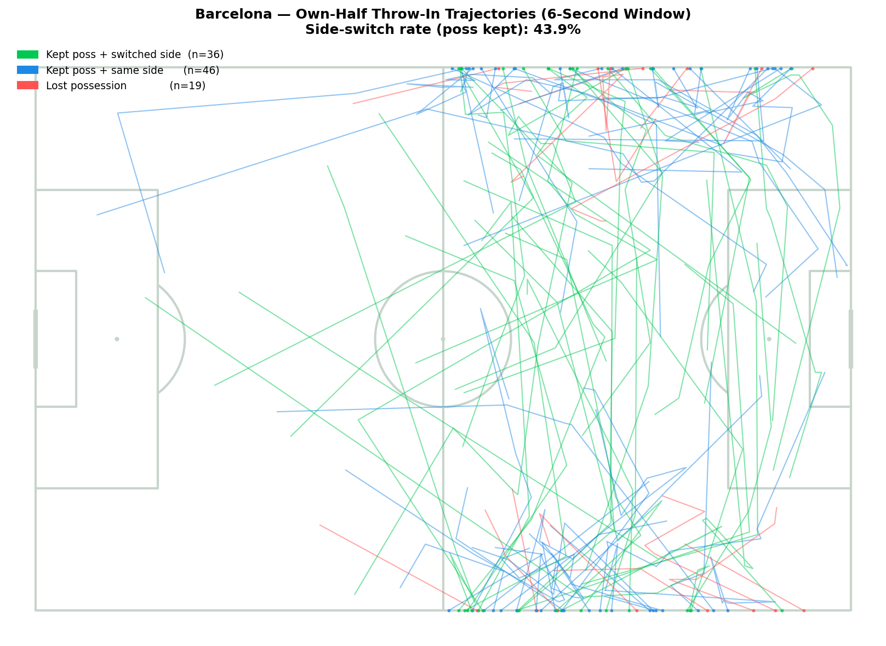
_Figure 22: Barcelona own-half throw-in trajectories within a six-second window, coloured by outcome_

The xG comparison in Figure 23 gives the headline finding. In their own half, Barcelona slightly outperform the league average (0.003 vs. 0.002 xG per throw-in), consistent with their stronger retention. In the opponent's half, however, the league average jumps to 0.005 while Barcelona's value stays flat at 0.003, despite a comparable volume of attacking-half throw-ins (n=95 vs. an average of 86). Where the typical team converts an advanced throw-in into measurably more chance creation, Barcelona's xG output remains tied to possession continuation regardless of pitch zone.
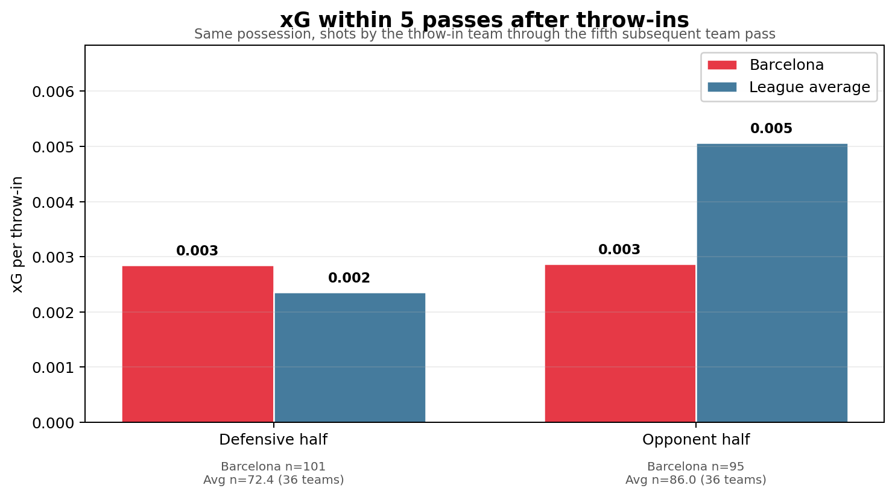
_Figure 23: Comparison of Barcelona's xG earned in the five passes after the throw-in - compared to competition average_

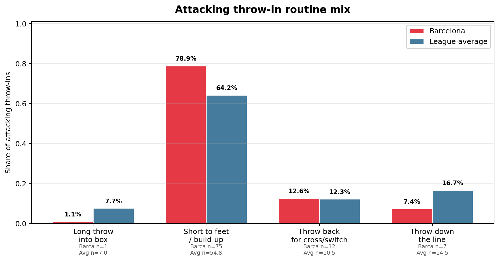
_Figure 24: Attacking throw-in routine mix — Barcelona vs. league average_

The routine-mix breakdown (Figure 24) explains why. 78.9% of Barcelona's attacking-half throw-ins are short throws to feet for build-up, compared with a league average of 64.2%. Throws down the line are taken about half as often as average (7.4% vs. 16.7%), and long throws into the box are practically absent (one occurrence across the competition, against a league average of seven per team). Barcelona therefore concentrate even more heavily on the possession-oriented routine than the typical Champions League team and almost completely avoid the routines most directly associated with attacking deliveries.

To summarize, these views suggest that Barcelona's throw-ins follow the same logic that already emerged from the dead-zone free-kick analysis. The team does not treat own-half throw-ins as direct attacking restarts but as opportunities to circulate, reset the structure and frequently switch the side of attack. The retention advantage compared with the league average is substantial, while the comparison with the strongest pressing-resistant teams shows that the underlying mechanism is less about surviving the first contact and more about Barcelona's ability to convert a retained throw-in into a meaningful change of position. This is consistent with the broader interpretation of the report: across corners, free kicks and now throw-ins, Barcelona's set-piece value tends to arise from controlled second-phase construction and positional manipulation rather than from physically dominant first-action solutions.

### Penalties

Barcelona were awarded four penalties in the competition and converted all of them, three taken by Lamine Yamal and one by Raphinha. 
With this sample size, no statistical claim about penalty quality or efficiency is meaningful. 
The aim of this subsection is therefore not to evaluate Barcelona's penalty performance in general, but to use the combined event and tracking data to identify execution patterns and contextual choices that the four cases make visible.

The freeze-frames at the moment of the kick (Figures 25–27) show a consistent structural setup across the three penalties for which player positions are available. 
In each case, five to six Barcelona attackers are arranged in a tight arc around the edge of the penalty area, with one attacker placed close to the six-yard line. 
The opposing team mirrors this arrangement with a similar arc on the opposite side. 
The shape repeats across three different opponents and looks designed rather than incidental: one near-post crasher, one or two players ready to attack the central rebound zone, and a screen of players at the D to recover any cleared ball.

|                                     Yamal vs. Olympiacos                                      |                                     Yamal vs. Newcastle                                      |                                  Raphinha vs. København                                  |
|:---------------------------------------------------------------------------------------------:|:--------------------------------------------------------------------------------------------:|:----------------------------------------------------------------------------------------:|
| 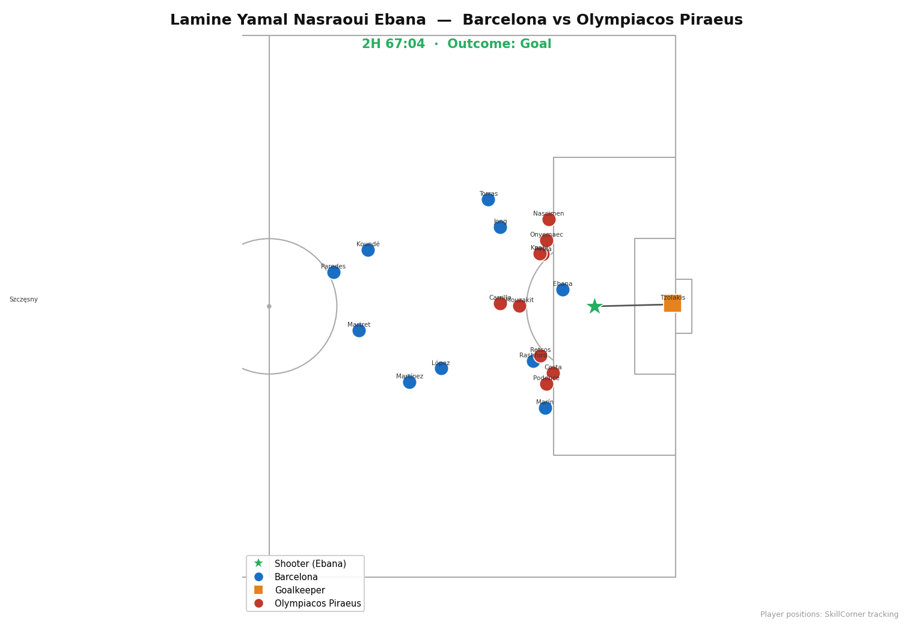 | 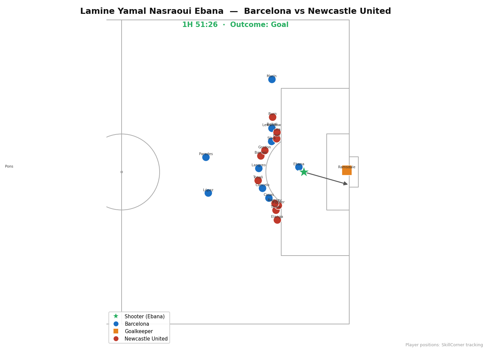 | 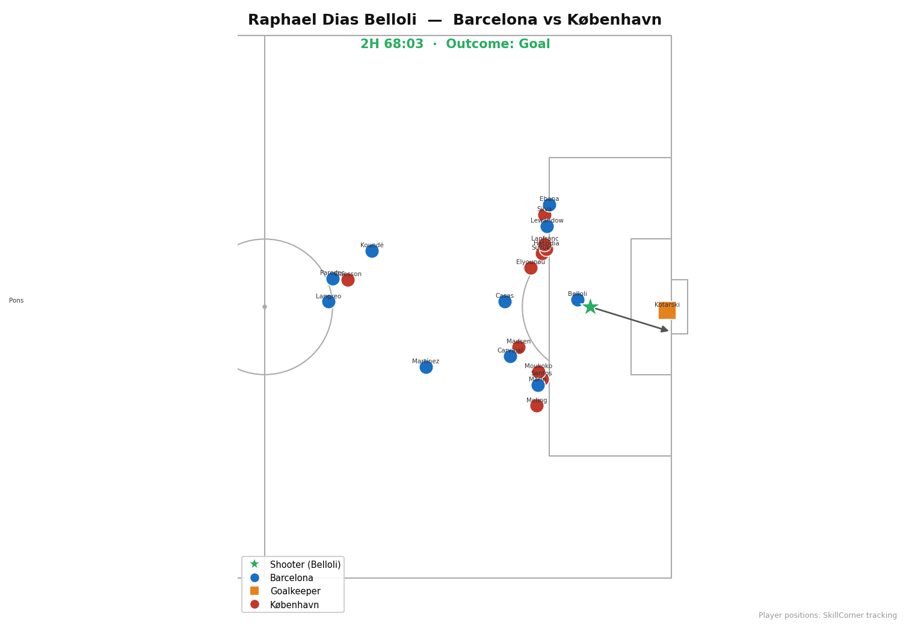 |

_Figures 25–27: Player positions at the kick moment for three of Barcelona's four penalties_

A closer look at who is positioned where, combined with the squad-wide top-speed ranking in Figure 28, suggests that the rebound-ready arrangement may not be optimised in terms of physical profile. Against Olympiacos and Newcastle, the Barcelona player positioned closest to the six-yard line is Marín, a peripheral squad option whose top speed is not among the team's tracked profiles. 
The genuinely fast attackers available in those games — Rashford (33.2 km/h), Koundé (31.9 km/h), Fermín López (31.2 km/h) — are positioned further out, on or near the edge of the box. 
A rebound from a saved penalty typically falls within the first few metres of the goal and requires explosive acceleration over a short distance: the player closest to that zone is therefore the most consequential rebound option, and one would expect that role to be filled by a fast, reactive attacker rather than a structural placeholder. 
The Copenhagen setup looks different in this respect: Lewandowski is the player closest to goal, and the high-speed group (Eric García 33.3 km/h, Koundé 31.9 km/h) is arranged in the second line. 
This is a more conventional rebound-oriented arrangement, although Lewandowski himself is in the middle range of the top-speed ranking and not among Barcelona's fastest profiles either.

Since none of the four penalties required a rebound, the practical cost of this arrangement is zero in the present sample. 
However, given that league-wide penalty conversion rates leave roughly one in four penalties unconverted, the positioning question is worth flagging as a potential blind spot in an otherwise consistent routine. 
Whether the choice reflects coaching preference, role conventions (e.g., reserving the fastest players for transitional defense after a saved penalty rather than for the rebound itself), or simply matchday squad availability cannot be resolved from the data.

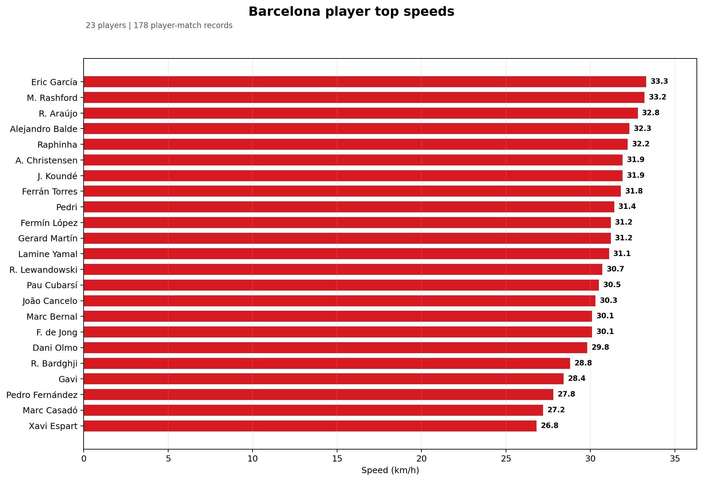
_Figure 28: Top running speeds of Barcelona's players across the competition_

The run-up overlay in Figure 29 adds the taker-side perspective. Yamal's two visualised approaches (vs. Olympiacos and vs. Newcastle) overlay almost perfectly: same starting position, same curvature, same final angle into the ball. 
This repeatability suggests that Yamal uses a rehearsed anlauf signature rather than improvising the approach. 
Raphinha's run-up against København is structurally different — shorter, straighter, and from a closer starting point — but the sample of one penalty does not allow a similar consistency statement for him. 
The two profiles together indicate that Barcelona's penalty execution is not built around a single team-wide template, but around individual taker routines.

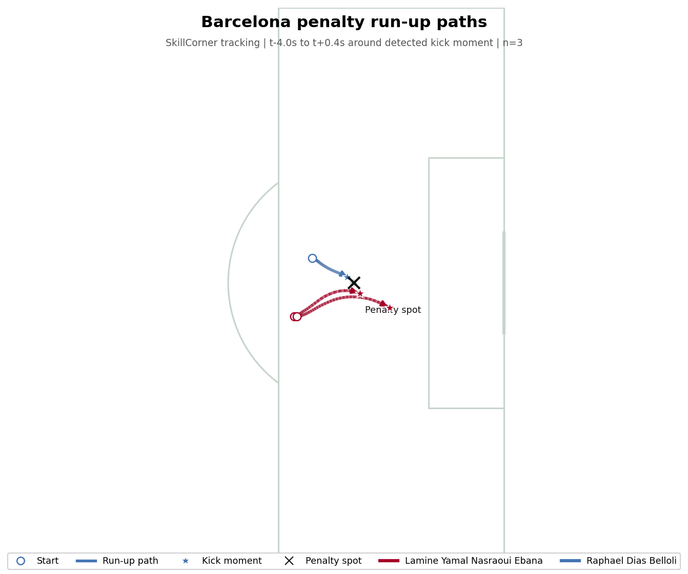
_Figure 29: Run-up paths of Barcelona's three CL penalties with available tracking data_

The goal-face view (Figure 30) closes the picture by combining shot placement with keeper behaviour. All four shots were placed low or in the lower half of the goal, and the four placements cover three different vertical strips: low-left of centre, central, and right (twice). 
In three of the four penalties the keeper committed to the taker's left before or at the moment of the kick, while Yamal's right-side and central finishes went away from the dive. 
The fourth case is the most informative: against København, the keeper dove correctly to the shot side, but Raphinha's placement in the lower-right corner was sufficient to beat him. 
The estimated shot speeds shown in the plot should be treated as relative comparisons only, as the values are too low in absolute terms to represent actual ball velocities and are clearly influenced by tracking sampling. 
The placement pattern, by contrast, is robust to this caveat.

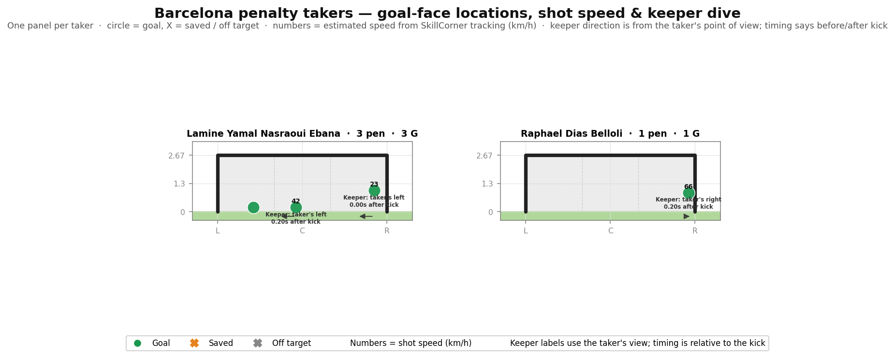
_Figure 30: Goal-face locations, estimated shot speed and keeper dive direction for Barcelona's four penalties_

Taken together, the four penalties suggest a coherent execution profile — low placement, a rehearsed run-up by the primary taker, beating keepers who committed early — combined with a rebound-ready box arrangement whose physical optimisation is less clear. 
The placement and run-up consistency point to a designed and well-practised individual routine; the positioning of fast attackers, by contrast, appears to vary by match and is not obviously aligned with the players best suited to capitalise on a parried shot. 
The four cases do not allow inference about general penalty performance, but as a snapshot of the routine the team has prepared, they show a clear taker-side picture and a more open question on the team-side structure around the kick.

## Goal kicks

_Figure 31: Distance distribution of goal kicks_

#### Goal Kicks

To analyse Barcelona's behaviour during goal kicks more formally, we use the pitch-control framework introduced by Fernandez and Bornn (2018) [^1]. Pitch control quantifies, for every location on the pitch, which team is more likely to reach the ball if it were played there. For a player $i$ at location $p_i(t)$, the influence at position $p$ and time $t$ is defined as

$$I_i(p, t) = \frac{f_i(p, t)}{f_i(p_i(t), t)}$$

where $f_i(p, t)$ is the pdf of a bivariate normal distribution that takes both direction and speed of the player into account.

The team-level pitch control then aggregates these individual influences across both teams, normalised through a logistic function:

$$PC(p, t) = \sigma\left( \sum_i I_i(p, t) - \sum_j I_j(p, t) \right)$$

The resulting maps (Figure 32) show, averaged across all of Barcelona's goal kicks in the competition, which areas of the pitch Barcelona controls at the moment the restart is taken, split by short kicks (n=31) and long kicks (n=16). Brighter zones indicate stronger Barcelona control, darker zones indicate opponent control.

Both maps show a textbook structural setup, but they differ clearly in shape. For short goal kicks, the high-control area is concentrated in Barcelona's own defensive third, with the brightest zones forming a wide, flat band across the back of the pitch. The fullbacks are visibly pushed wide towards the touchlines, opening passing angles outside the first opposition pressing line, while a central midfielder drops deep between the centre-backs to offer a vertical option through the middle. The structure is consistent with a possession-oriented build-up routine: rather than aiming to win territory immediately, Barcelona create multiple short passing options around the goalkeeper that allow them to escape pressure into controlled possession in their own half.

For long goal kicks, the control map changes in a recognisable way. The bright zone shifts forward into the centre of the pitch, around and slightly behind the halfway line, and forms a clear V-shape opening towards Barcelona's attacking half. This is the canonical second-ball structure: the long ball is targeted into a contested central zone, with attackers positioned at the tip of the V to challenge for the first contact and midfielders arranged behind them along the diverging arms of the V to recover knock-downs and second balls. Barcelona's pitch control in this area is not dominant, which is expected since long-ball receptions are inherently contested, but the symmetry of the structure shows that the team is positioned to compete for the second ball regardless of which side it falls towards.

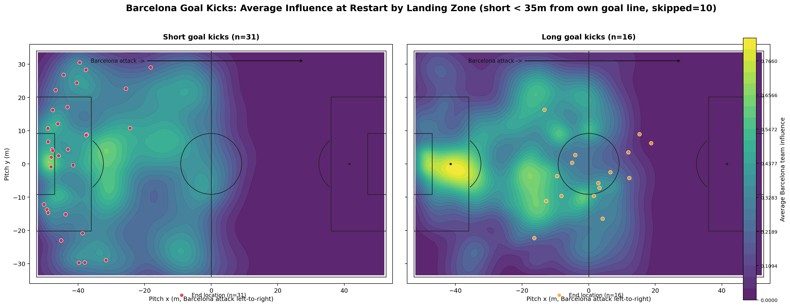
_Figure 32: Average pitch control at short (n=31) and long (n=16) goal kicks_

A representative example of how this short build-up routine unfolds in practice is shown in Figure 33, a sequence against PSG. The freeze-frame at the moment of the goal kick illustrates the structural intent already visible in the average pitch-control map: the fullbacks are positioned wide along the touchlines, the central midfielders drop into the half-spaces just outside the penalty area to offer short vertical options, and the centre-backs split into the corners of the box to provide angled passes from the keeper. The opponent's first pressing line is concentrated centrally just outside the box, which leaves the wide outlets uncontested — exactly the situation the structure is designed to create.

The full animation shows a recurring pattern that appears across most of Barcelona's short goal kicks. The keeper plays a short pass to one of the centre-backs in the box corner, who immediately progresses the ball to the fullback on the same side. From there, Barcelona look for one of two continuations. The first is a combination with the winger or attacking midfielder in the wide corridor, using a give-and-go or a third-man pattern to escape the first pressing wave along the touchline. The second is a switch towards the centre, either through a dribble carry into the half-space by the fullback, or through a diagonal pass into the dropping central midfielder, who then redirects the build-up to the opposite side of the pitch. In both cases, the goal kick is treated as the first action of a structured possession sequence rather than as an isolated restart.

The PSG sequence is particularly instructive because PSG are among the most aggressive pressing teams in the competition. The structure still produces a clean exit through the wide channel, which suggests that the routine is robust to high-pressure opponents and not only used against passive defensive blocks. This pattern repeats with minor variations across the short goal-kick sample and explains the broad, wide-shaped high-control band in the average map (Figure 32): different opponents force Barcelona into slightly different specific continuations, but the underlying first three actions — keeper to centre-back to fullback — remain remarkably consistent.

_Figure 33: Build up sequence against PSG_

Both routines therefore reflect well-organised, distinct strategic shapes rather than improvised positioning. The short goal-kick setup is built around generating safe passing options close to the keeper and circulating out of pressure, while the long goal-kick setup is built around contesting the second ball in central midfield. Together, the two maps illustrate that Barcelona's goal kicks are not a passive restart but a structured first action with different shapes depending on the chosen routine.

### Conclusion and Recommendations

The offensive analysis confirms several central expectations from the report of previous analyses, but also adds important nuance. 
Barcelona's set pieces under Flick do not appear to be isolated dead-ball events. 
They are often used as tactical extensions of the team's broader attacking identity. 
Some routines are designed to create immediate danger, while others are used to improve the next possession state through structure, side changes, and controlled second-phase construction. 
This is visible not only in corners, but also in crossed free kicks, dead-zone free kicks, and throw-ins.

For offensive corners, the data supports the idea that Barcelona use a clearly structured approach. 
Their routine profile is strongly shaped by direct inswingers, with short corners as a meaningful secondary option. 
This partly confirms the hypothesis that Barcelona's corners are not only designed to deliver the ball into dangerous areas, but also to manipulate the opponent's defensive shape beforehand. 
The short-corner threat, compact box occupation, and local overloads all indicate that Barcelona try to influence how the opponent defends the box before the decisive action happens. 
At the same time, the analysis also shows that tactical structure does not automatically translate into elite output. 
Barcelona remain below the competition average in attacking-corner xG and attempt production, so the design might appear more convincing than the final efficiency.

The hypothesis that Barcelona repeatedly create far-post access is supported, but in a more selective way than previous analyses suggested. 
In the current Champions League sample, far-post deliveries are visible, but they are not a constant default pattern. 
Instead, they seem to appear in specific matchups, especially against Newcastle, Copenhagen, and later Atlético Madrid. 
This suggests that the far post is not Barcelona's universal attacking corner solution, but rather a tactical weapon used under particular opponent conditions. 
Raphinha's individual delivery profile strengthens this interpretation, because he is clearly linked to these far-post deliveries

The strongest support appears for the hypothesis that Barcelona create danger through coordinated runs, second balls and continuation actions rather than through one or a few primary aerial targets. 
Several findings point in this direction. 
The first-touch maps show many continuations through pass-ons and carries, the goal sequences often involve more than one action and the movement examples show compact occupation followed by coordinated adjustments rather than simple first-contact attacks. 
The Frankfurt corner goal and the Newcastle free-kick goal are especially important examples. 
In both cases, Barcelona use the first action not only to finish directly, but to move the defensive structure and create the decisive follow-up situation.

The free-kick analysis broadens this conclusion. 
Unlike corners, attacking free kicks show a clearly positive statistical signal. 
Barcelona are above average in goals, shot rate, and total xG, while their conversion rate is close to the competition average. 
This makes the free-kick profile especially relevant, because the advantage is supported by process rather than only finishing. 
The routine-level analysis shows that Barcelona’s free kicks are more situational than corners. 
Responsibilities are spread across several takers, and the routine choice depends strongly on zone, angle, and tactical purpose. 
Crossed free kicks from half-spaces connect most clearly to the corner-related expectations, especially when they create central receptions, lay-offs, and second actions.

Dead-zone free kicks and throw-ins show a layer of Barcelona's traditional offensive possession-oriented identity. 
These situations are not primarily used to force attempts directly, but function as positional tools. 
Barcelona use them to reset structure, switch the side of play and escape pressure. 
The OBV values are small, but the high share of positive actions indicates that these restarts are usually not wasted. 
This shows that even in a more vertical Flick-era context, the team still uses many restarts to control the next phase rather than force immediate danger.

Overall, the offensive analysis largely supports the hypotheses from the report of previous analyses. 
Barcelona use corners and comparable indirect free kicks not only as delivery situations, but also to manipulate defensive shape through short options, compact occupation and local overloads. 
Far-post access is visible as well, although more as a matchup-specific weapon than as a constant pattern. 
The strongest confirmation concerns second-phase construction: danger often emerges through knockdowns, lay-offs, second balls, side changes, or controlled continuation rather than through one dominant aerial target. 
At the same time, the moderate corner output shows that tactical structure does not automatically produce elite efficiency.

From a recommendation perspective, Barcelona should continue developing short-corner and second-phase routines, because these appear to fit their physical profile and provide a way to create danger without relying on aerial superiority. 
Far-post deliveries should remain part of the repertoire, but the current evidence suggests they may be most effective as matchup-specific weapons rather than as a standard routine. 
For crossed free kicks, the deeper central reception and lay-off patterns should be further explored, as they connect well to the successful principles already visible in corners. 
In dead-zone free kicks and throw-ins, the team’s ability to retain and improve possession is a strength, but there may be additional potential in selectively using longer progressive passes when the opponent’s structure is open. 
Finally, penalty rebound positioning could be reviewed, especially regarding whether faster or more reactive players should occupy the most direct rebound lanes.

## Citations
[^1]: Fernandez, J. and Bornn, L. (2018). _Wide Open Spaces: A statistical technique for measuring space creation in professional soccer._ MIT Sloan Sports Analytics Conference.