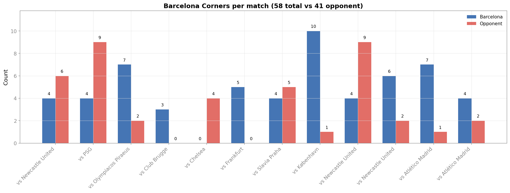
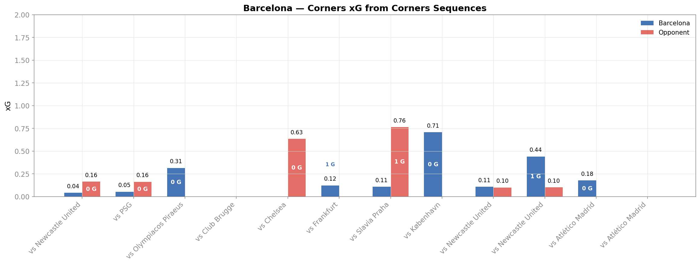
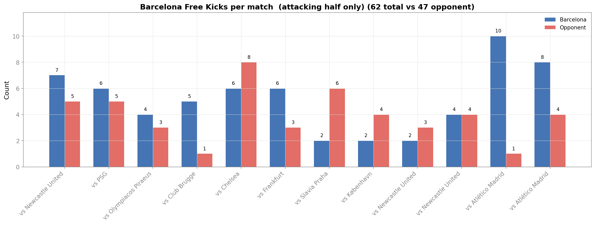
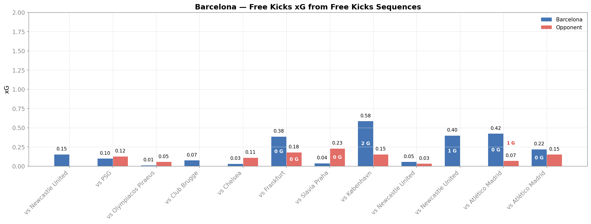
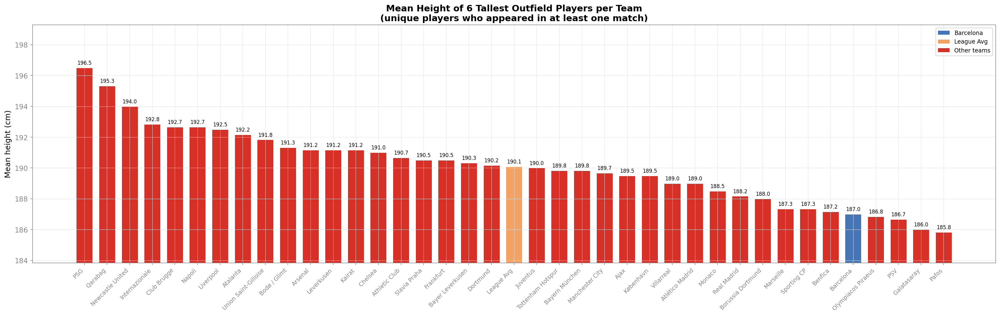
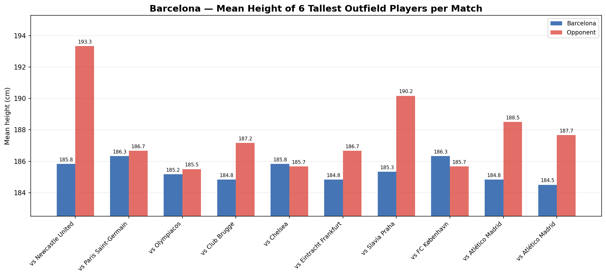

<!--
**TODO:**

 - Create tables to allow for quick comparison of BAR value, mean and rank; when final data is available.
--> 

## Overview on Set Piece Statistics of FC Barcelona

### Offensive Set-Pieces

#### Offensive Free-kick Sequences

Barcelona’s attacking free-kick profile is one of the clearest positive signals in the dataset for chance creation, although the finishing component has come back toward average after the quarter-finals.

They scored **3 goals from free-kick sequences**, **above the competition average of 1.94** [(stat-of1)](BAR-SP/statistics_plot#total-goals-conceded-from-free-kicks---barcelona-below-average). 
Their process numbers are even more supportive. 
They **generate a shot from 50.0% of attacking free kicks**, compared with a **league average of 45.2%** [(stat-of2)](BAR-SP/statistics_plot#attempts-per-free-kick---barcelona-above-average). 
Their total **xG from free-kick sequences is 2.46**, well above the **league average of 1.79** [(stat-of3)](BAR-SP/statistics_plot#total-xg-from-free-kicks---barcelona-above-average).
Their **goal conversion per free kick is 4.8%**, essentially in line with the **competition average of 4.7%** [(stat-of4)](BAR-SP/statistics_plot#goals-per-free-kick---barcelona-significantly-above-average) - a notable shift from the league-phase picture, driven by the two Atlético Madrid quarter-final matches in which Barcelona generated 18 attacking free kicks and 0.64 xG without scoring.

This combination is important. 
Barcelona produce clearly above-average shot volume and xG from these situations, but their conversion rate is now in line with the field. 
That means the offensive strength is supported by chance creation rather than by a finishing spike. 
The overview therefore suggests that Barcelona's attacking free-kick routines are above average in terms of generating opportunities, while the underlying xG remains the more reliable indicator of their threat than the raw goal count.

#### Offensive Corner Sequences

The picture changes considerably for attacking corners - Barcelona scored 2 goals from corner sequences, just below the competition average of 2.19 [(stat-oc1)](BAR-SP/statistics_plot#total-goals-from-corners---barcelona-matches-average).

Their **attempt rate per corner is 39.7%**, clearly below the league average of 47.7% [(stat-oc2)](BAR-SP/statistics_plot#number-of-attempts-per-corner---barcelona-below-average).
Their average xG from corners per game is 0.172, below the average of 0.219, and their **total corner xG is 2.07** compared with a **competition average of 2.27** [(stat-oc3)](BAR-SP/statistics_plot#average-xg-generated-after-corners---barcelona-below-average). 
Their **goal rate per corner is 3.4%**, again **below the competition mean of 4.7%** [(stat-oc4)](BAR-SP/statistics_plot#goals-per-corner---barcelona-below-average).

So while Barcelona are not weak from corners, they are also not one of the standout attacking corner sides in this UCL field, and the gap to the league average has actually widened slightly after the quarter-finals (11 corners taken across the two Atlético legs produced 0.18 xG and 0 goals). 
In overview terms, that is one of the most important findings from the plots. 
It suggests that Barcelona’s current set-piece profile should not be framed too heavily around corner dominance only in the subsequent report.
It is to note that this does not contradict the tactical literature entirely (especially due to the limited number of observations), but emphasises the need to analyse structure, manipulation, and match-specific execution, which only becomes visible in the later sequence-based analysis.

#### Offensive Interpretation and Implications for further Analysis

Barcelona’s attacking set-piece profile suggests an effective but not uniformly dominant side across all dead-ball situations. 
The clearest offensive strength appears in free-kick sequences rather than corners. Barcelona perform clearly above average in attacking free-kick situations, both in terms of goals and underlying chance creation, while their attacking corner output is closer to average, or slightly below average, across attempts, expected goals, and conversion. 
This may indicate that under Hansi Flick, Barcelona have become more effective in structured, direct attacks following restarts, without necessarily showing clear superiority in aerial situations or corner output. 
Taken together, this points to a set-piece profile that is more efficient in free kicks than dominant in corners, which slightly qualifies the literature-based expectation of Barcelona as a particularly corner-focused attacking side under Flick.

This is particularly relevant for the subsequent analysis, as it helps define the main analytical focus. 
In the case of free kicks, the key question is why these routines generate efficient outcomes. 
For corners, the more relevant question is whether the underlying tactical structure is stronger than the raw output alone suggests.

### Defensive Set-Pieces

#### Defensive Free-kick Sequences

FC Barcelona conceded **1 goal from free-kick sequences**, while the competition average is 1.94 [(stat-df1)](BAR-SP/statistics_plot#total-goals-conceded-from-free-kicks---barcelona-below-average). 
This is also reflected in their average xG conceded from free-kick sequences per game which is only 0.091, far below the mean of 0.183 [(stat-df2)](BAR-SP/statistics_plot#average-conceded-xg-from-free-kicks-per-game---barcelona-below-average). 
They allow shots from just 36.2% of free kicks faced in their own half of the pitch, compared with a league average of 44.7% [(stat-df3)](BAR-SP/statistics_plot#average-conceded-attempts-from-free-kick-sequences---barcelona-below-average).

Barcelona concede 3.92 free kicks in their own half per game, slightly **below the competition average of 4.18** [(stat-df4)](BAR-SP/statistics_plot#number-of-free-kicks-conceded---barcelona-above-average). 
The volume effect is therefore small. The much larger gaps appear once those situations happen, where Barcelona suppress shots and xG far more effectively than the field.
That makes defending free kicks one of the clearest strengths of Barça in the quantitative overview.

#### Defensive Corner Sequences

Barcelona also defend corners similarly well in the UCL sample. 
They **conceded only 1 goal from corner sequences**, compared with a **competition average of 2.22** [(stat-dc1)](BAR-SP/statistics_plot#total-goals-conceded-from-corners---barcelona-below-average). 
Their average xG conceded from corners per game is 0.160, lower than the league average of 0.225 [(stat-dc2)](BAR-SP/statistics_plot#average-conceded-xg-from-corners-per-game---barcelona-below-average). 
They **allow a shot from only 29.3% of corners faced**, dramatically **lower than the average of 47.6%** [(stat-dc3)](BAR-SP/statistics_plot#average-conceded-xg-from-corners-per-game---barcelona-below-average), and they concede goals on just 2.4% of corners faced, compared with a competition mean of 4.7% [(stat-dc4)](BAR-SP/statistics_plot#goals-conceded-per-corner---barcelona-performs-well).
Barça also faces relatively few corners in the first place: 3.42 corners conceded per game versus a competition average of 4.78 [(stat-dc5)](BAR-SP/statistics_plot#average-corners-faced-per-game---barcelona-below-average).

It is particularly interesting given the tactical literature that often frames Barcelona as potentially vulnerable to physical or aerial stress. 
In this UCL sample, the aggregate numbers do not show an obviously fragile corner-defending side. 
Instead, they show a team that is, at minimum, well above average in suppressing corner danger.

#### Defensive Interpretation and Implications for further Analysis

The defensive overview is arguably the most striking part of the dataset. 
Barcelona looks consistently solid to strong across both major set-piece types, especially in the prevention of attempts and xG.
This matters for the interpretation of Barcelona’s style. 
A team with an aggressive, front-foot, high-line identity is often assumed to be more exposed in restart situations, especially against physically strong opponents. 
Based on our UCL data, Barcelona instead look like a side whose overall set-piece defending is organised, controlled and efficient. 
That may suggest improvements in collective spacing, first-contact control, or opposition shot suppression, even if some individual sequences later might reveal vulnerabilities.
Such improvements of defensive weakness should later be tested through sequence-level evidence rather than assumed from reputation.

### Set-Piece Performance in FC Barcelona Matches

Across Barcelona’s individual UEFA Champions League matches, the set-piece data indicate them as a team whose dead-ball output was highly dependent on match context rather than consistently strong across games. 
This aligns with the broader overview that Barcelona was not a clear corner outlier overall, but still able to generate substantial value from set pieces in specific match situations.

Their corner volume and corner xG vary considerably (refer to the plots below). 
For example, against Copenhagen, Barcelona created strong attacking pressure from corners (10 corners, 8 corner-sequence attempts and 0.71 xG), yet failed to score. 
In contrast, matches against Club Brugge and Chelsea produced almost no attacking corner output, and the two Atlético Madrid quarter-final legs combined for 11 corners but only 0.18 xG and 0 goals. 
This suggests that Barcelona’s corner threat depends strongly on game state, territorial dominance, and especially opponent behaviour, rather than on a stable level of corner efficiency.

_Figure 1: Number of corners in Barcelona Games_

_Figure 2: xG from corners in Barcelona Games_

Free-kick sequences, by comparison, appear to provide more consistent value. 
Particularly productive performances were observed against Frankfurt (0.38 xG, 0 goals), Copenhagen (0.58 xG, 2 goals), Newcastle (0.40 xG, 1 goal) and the first leg against Atlético Madrid (10 free kicks, 0.42 xG, 0 goals). 
This supports the earlier interpretation that Barcelona’s stronger attacking set-piece profile in this campaign was driven more by free kicks than by corners, even though the two Atlético legs in particular produced strong underlying numbers without any goals.

_Figure 3: Number of free-kicks in Barcelona Games_

_Figure 4: xG from free-kicks in Barcelona Games_

### Player Physicality

The physicality plots show that Barcelona are among the less physically dominant teams in the competition in terms of height. 
The mean height of their six tallest outfield players is 187.0 cm, below the competition average of 189.2 cm, and this lower profile is also evident in several individual matches, particularly against taller opponents such as Newcastle (193.3 cm), Slavia Praha (190.2 cm) and Atlético Madrid (188.5 cm and 187.7 cm in the two quarter-final legs).

_Figure 5: Mean height of 6 tallest outfield players per team_

_Figure 6: Height head-to-head in Barcelona matches_
<figcaption style="margin: 0 0 0 5px">We generated the plot using snippet $2769</figcaption>

This is relevant in light of the set-piece findings so far. 
Barcelona’s relatively modest corner output and their greater attacking effectiveness in free-kick sequences than in corners, are consistent with a team that does not rely on clear aerial superiority. 
Instead, their set-piece profile appears to depend more on delivery quality, movement, structure and spatial manipulation. 
At the same time, their strong defensive set-piece numbers despite this physical disadvantage suggest that their success is driven less by size than by organisation, shot suppression and collective control of set-piece situations.